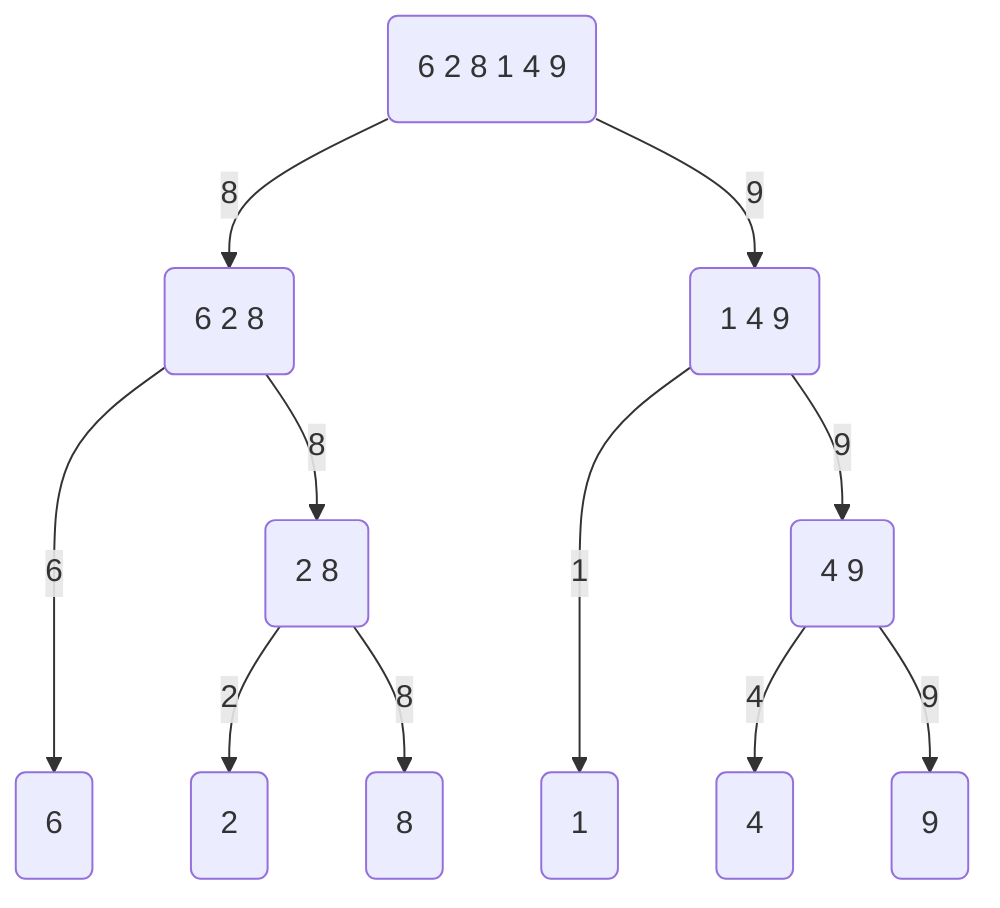
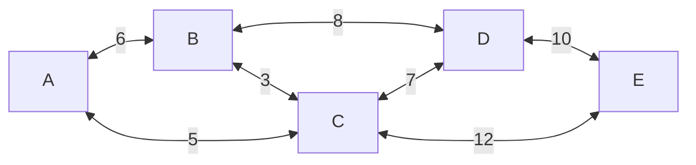
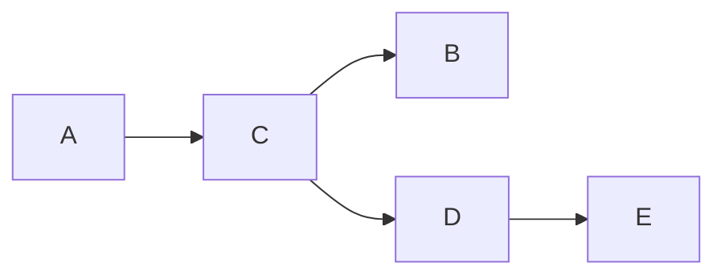

# Alapfogalmak

## Algoritmus

Olyan jól definiált számítási eljárás, amely bementként bizonyos értékeket kaphat, és kimenetként bizonyos értékeket állít elő. Ezeket vizsgálhatjuk helyesség, idő- és tárigény szerint.

## Adatszerkezet

Adatok tárolására és szervezésére szolgáló módszer, amely lehetővé teszi a hozzáférést és a módosítást.

## Futási idő
Egy bizonyos bemenetre a végrehajtott (gépfüggetlen) alapműveletek vagy "lépések" száma

## Időigény
Egy algoritmus időigénye T(n), ha az algoritmus tetszőleges n méretű inputon T(n) idő alatt megáll

Big O / Ordó: legrosszabb eset
Big Theta: átlagos eset

# Részproblémára bontó algoritmusok

## Mohó

A mohó algoritmusok minden adott lépés esetén az optimálisnak tűnő lehetőséget választják.

Egyserű, nem lehet mindig meglépni.

Ha mégis, akkor nagyon hatékony megoldás.

Cél, hogy egyetlen részproblémát hozzunk létre -> ennek megoldása az OG probléma optimális megoldása is.

Pl.: Töredékes hátizsák probléma

Bemenet:
- Hátizsák kapacitása (S)
- n darab tárgy, aminek a kapacitásigénye S(i), az értéke meg E(i),  0 <= i < n

Kimenet:
- Mi a legnagyobb SUM(E), amely esetén a SUM(S) S kapacitással megegyezik, vagy alatta van?

Probléma mohó megoldása: számoljuk ki az érték/kapacitásigény arányt. Válasszuk ki ez az arány szerint a legnagyobbat addig, amíg már nem fér be egész tárgy a táskába. Ekkor vesszük a legértékesebb tárgyunkat, és azt eltörjük úgy, hogy pont beférjen a maradék helyre. (Maradék hely / a tárgy kapacitása)

## Oszd meg és uralkodj

Az oszd meg és uralkodj algoritmusokat:
    - felosszuk diszjunkt részekre, rekurzívan elkezdjük őket megoldani
    - uralkodás: elég kicsi részfeladatokat megoldunk egyből
    - részeredményeket összevonjuk

Példa: maximum egy tömbben

Bemenet:
    - egy tömb, illetve a vizsgált szekció kezdő és végindexe
Kimenet:
    - a maximum érték a tömbben

A függvényünk mellé egy segédfüggvényt is létrehozunk, amely kettő számról mondja meg, hogy melyik a legnagyobb: 

```c
int max(int x, int y) {
    return (x < y) 
        ?  y 
        : x;
}
```

```c

int maxInArray(int array[], int lowest, int highest) {
    // ha a kezdőindex nagyobb lenne, mint a végindex, az érvénytelen, adjuk meg a legkisebb létező számot, hogy az eredmény összesítéskor ez az eset dominálva legyen
    if (lowest > highest) {
        return INT_MIN;
    }

    /* 
Uralkodj rész: legegyszerűbb eset, amikor csak egy elem van a vizsgált szakaszban, hisz akkor az a legnagyobb
    */
    if (lowest == highest) {
        return array[lowest];
    }

/*
Felosztás: ketté szedjük a tömböt, és benne keressük a maximumot
*/
    int mid = (lowest + highest) / 2;

    int left = maxInArray(array, lowest, mid);
    int right = maxInArray(array, mid + 1, highest);

/*
Összevonás: a kettő eredmény közül megnézzük melyik a nagyobbb, és azt adjuk meg (rész)eredménynek
*/
    return max(left, right);
}


// használat
int array[] {6, 2, 8, 1, 4, 9}; // length = 6
int result = maxInArray(
    array, 0, 5 // length - 1
); // 9
```




## Dinamikus

A dinamikus annyiban különbözik az oszd meg és uralkodj módszertől, hogy a részproblémáknak nem kell diszjunktnak lenniük. Dinamikus probléma esetén a részproblémák megoldásait eltároljuk (cache-ljük) valamilyen adatszerkezetben (például egy tömbben), és újboli előfordulás esetén felidézzük azt.

Pl. adott n típusú pénzérme, mennyi az a legkevesebb érme, amellyel kifizethető F mennyiségű összeg. (Ha az nem fizethető ki, akkor legyen -1 a feladat megoldása)

Oszd meg és uralkodj:
Érmék: 1, 5, 6
minPenz(9) = min(
    minPenz(9 - 1) + 1,
    minPenz(9 - 5) + 1,
    minPenz(9 - 6) + 1
)

Kódban

```c#
int minPenz(int f, int[] ermek, int?[] cache = null) {
    // hozzuk létre a cache-t, ebbe tároljuk el a legjobb eredményt a részproblémákhoz (mivel a tömb indexe 0 alapú, a legkisebb részprobléma pedig valószínűleg 1 lesz, ezért elcsúsztatjuk 1-gyel, így )
    if (cache is null) {
        cache = new int[f - 1];
    }

    // ha már egyszer kiszámoltuk hogy hány érmébe fáj kifizetni az összeget, akkor adjuk vissza annak az eredményét
    if (cache[f - 1] is not null) {
        return cache[f - 1];
    }

    int result = int.MAX_VALUE; // maximum létező int érték
    for (int i = 0; i < ermek.Length ; i++) {
        // alap eset, ha valamelyik érmével megegyezik akkor biztosan 1 pénzérmével ki tudjuk fizetni az adott összeget
        if (f == ermek[i]) {
            // tároljuk el a cahe-be a megoldásunkat
            cache[f - 1] = 1;
            return 1; 
        }

        // számoljuk ki, hogyha a jelenlegi érmét használnánk, hány érmével fizetünk
        // azaz számoljuk ki, hogyha kivonjuk az érméből az összeget, akkor azt hány érmébe fájna kifizetni (+1 hisz a mostani érmét is felhasználjuk)
        int subResult = minPenz(f - ermek[i], ermek, ermekSzama, cache) + 1;

        // tároljuk el a kisebb megoldást a jelenlegi meg a most kapott megoldás közül
        result = min(result, subResult);
    }

    // tároljuk el a cache-be a megoldásunkat
    cache[f - 1] = result;
    return result;
}
```

# Rendező algoritmusok

Bemenet: egy n hosszú tömb

Kimenet: sorbarendezett tömb (tehát az elemekre igaz, hogy a0 <= a1 <= a2 <= ... <= a(n-2) <= a(n-1))

## Beszúró rendezés

- Iteráljunk végig a tömbbön a második elemtől fogva.
    - Az aktuális elem lesz a kulcs
    - Az aktuális iterációtól (azt kihagyva) kezdjünk el balra fele iterálni, amíg van elem és a kulcs kisebb mint az aktuális elem a belső iterációba
        - csúsztassuk a tömböt jobbra
    - a kulcsot szúrjuk be a balrafele tartó iteráció végén

```c#
void InsertionSort(int[] array) {
    for (int j = 1; j < array.Length; j++) {
        int key = array[j];
        int i;
        for (i = j - 1; i >= 0 && array[i] > key; i--) {
            array[i+1] = array[i];
        }
        array[i + 1] = key;
    }
}
```

Magyarul: a tömb elemein végig megyünk (másodiktól fogva), és amíg tőle balra vannak tőle nagyobb számok, azokat átpakoljuk a jobboldalára

Pl.:

[5, 8, 2, 9, 3]

A 8-astól balra csak az 5-ös van kisebb

A 2-estől balra van az 5-ös és a 8-as, ezeket átmozgatjuk a 2-es másik oldalára így megkapjuk

[2, 5, 8, 9, 3]

A 9-estől balra csak kisebb elemek vannak (ezt onnan tudjuk, hogy a tőle balra lévő résztömb már sorba van rendezve, így a mellette lévő szám a legnagyobb, tehát ha az kisebb, akkor az összes többi is), így nem mozgatunk semmit

A 3-astól balra lévő elemek a 2-esig nagyobbak, így azokat átmozgatjuk a 3-as jobb oldalára

[2, 3, 5, 8, 9]

És kész a sorba rendezés.

Legrosszabb esetben a futásidő Ordó(n^2).

## Összefésülő rendezés

Egy D&C megoldás, kisebb altömböket rendezünk sorba, majd azokat fésüljük össze

Kód:
```c#

void Merge(int[] array, int left, int middle, int right) {
    // ha kiszámoljuk, a +1 nélkül a középső elemnek nem lenne helye, azért kell valamelyik tömbbe a +1
    int leftLength = middle - left + 1;
    int rightLength = right - middle;

    int[] leftArray = new int[leftLength];
    int[] rightArray = new int[rightLength];

    for (int index = 0; index < leftLength; index++) {
        leftArray[index] = array[left + index];
    }

    // mivel a középső elemet a bal oldali tömbbe raktuk, így a tőle eggyel utána lévővel kezdjük a feltöltését a jobb oldali elemnek, ezért kell a +1
    for (int index = 0; index < rightLength; index++) {
        rightArray[index] = array[middle + 1 + index];
    }

    int leftIndex = 0;
    int rightIndex = 0; 
    int resultIndex = left;

    while (leftIndex < leftLength && rightIndex < rightLength) {
        if (leftArray[leftIndex] <= rightArray[rightIndex]) {
            array[resultIndex] = leftArray[leftIndex];
            leftIndex++;
        } else {
            array[resultIndex] = rightArray[rightIndex];
            rightIndex++;
        }

        resultIndex++;
    }

    while (leftIndex < leftLength) {
        array[resultIndex] = leftArray[leftIndex];
        leftIndex++;
        resultIndex++;
    }

    while (rightIndex < rightLength) {
        array[resultIndex] = rightArray[rightIndex];
        rightIndex++;
        resultIndex++;
    }
}

//               0  1  2  3  4  5
// példa input: [6, 4, 7, 3, 9, 1], 0, 5
void MergeSort(int[] array, int left, int right) {
    if (left >= right) {
        return;
    }

    int lengthToMergeSort = right - left + 1;
    int middle = left + lengthToMergeSort / 2 - 1;

    MergeSort(array, left, middle);
    MergeSort(array, middle + 1, right);
    
    Merge(array, left, middle, right);
    
}
```

Futásidő: Theta (n*logn) átlagosan

O(n) idő ketté szedni a tömböt
theta n idő újra összekombinálni
a részre osztásnál folyamatosan felezzük a tömböt, log2(n) a leosztási szakaszok száma, ezt megszorozzuk a leosztási szakasz költségével ami O(n)

Mivel a leosztási szakasz dominálja az algoritmust, ezért következik a Theta(n*logn)

## Kupacrendezés

## Gyorsrendezés

Szintén D&C, jobb a merge sortnál, mert nem hoz létre ideiglenes bal meg jobb tömböt, helyben rendez. A felosztás egy kulcs segítségével történik, ez alapján a nála kisebb elemek a baloldali tömbbe kerülnek, a nála nagyobbak a jobb oldaliba. A vele egyenlőek nem lényeges hova, csak figyeljünk oda, hogy ne legyenek duplikálva.

Futásidő: legrosszabb esetben O(n^2), átlagos esetben O(n*logn), Tárigénye O(log(n)) 

```cs
int Partition(int[] array, int low, int high) {
    int key = array[high];

    int leftIndex = low - 1;

    for (int rightIndex = low; rightIndex <= high - 1; rightIndex++) {
        if (array[rightIndex] < key) {
            leftIndex++;

            // cseréljük meg a bal és a jobboldali elemet
            var leftItem = array[leftIndex];
            var rightItem = array[rightIndex];
            array[leftIndex] = rightItem;
            array[rightIndex] = leftItem;
        }
    }

    leftIndex++;

    var keyItem = array[high];
    // ez az a legnagyobb szám lesz, ami még kisebb a kulcsnál
    var topRightItem = array[leftIndex];

    array[leftIndex] = keyItem;
    array[high] = topRightItem;
    return leftIndex + 1; // ez az új kulcs index
}

// pl.      [6, 1, 7, 3, 9, 4], 0,       5
void QuickSort(int[] array, int low, int high) {
    if (low >= high) {
        return;
    }

    int keyIndex = Partition(array, low, high);
     // a keyIndexet nem sortoljuk, ahhoz nem nyúlunk, hisz tőle balra kerülnek a kisebb, jobbra a nagyobb elemek, azaz ő marad ott ahol van
    QuickSort(array, low, keyIndex - 1);
    QuickSort(array, keyIndex + 1, high);
}
```

## Leszámláló rendezés

# Gráfalgoritmusok

Jelölések
G=(V,E), 
G a Gráf (Graph), 
V a csúcsok (vertex / vertices), 
E az élek (edges)
w(u, v) az u és v csúcsok közti súly vagy költség (weight)

## Minimális feszítőfa
olyan útvonal, ami az összes csúcsot érinti, de minimális, és nincs benne kör

### Kruskal algoritmus:

O(E\*logE) vagy O(E\*logV)
mohó algoritmus

Sorbarendezzük az ismert éleket a költségük szerint

Kezdetben létrehozunk egy üres halmazt
Elkezdjük hozzáadni az éleket a legkisebb költségtől DE CSAK HA AZ NEM EREDMÉNYEZ KÖRT




```
       MST = {}
BC 3   MST = {BC}
AC 5   MST = {BC, AC}
AB 6   MST = {BC, AC} (kör lenne)
CD 7   MST = {BC, AC, CD}
BD 8   MST = {BC, AC, CD} (kör lenne)
DE 10  MST = {BC, AC, CD, DE}
CE 12  MST = {BC, AC, CD, DE} (kör lenne)
```

### Prím algoritmus

Választunk egy tetszőleges gyökér csúcsot, és innen kötünk be minden egyes iterációval a legkevesebb költséggel járó következő csúcsot.


```
A-->C-->B (most AB-t bekötni körrel járna, azt kihagyjuk)
C-->D (BD körrel járna)
D-->E (CE körrel járna)
```



## Legrövidebb út probléma

Bemenet: irányított, súlyozott gráf, és egy s kezdő csúcs
Kimenet: minden csúcshoz a legrövidebb út

### Dijkstra

Csak pozitív élő csúcsokon működik

Mohó algoritmus

Futásideje O(ElogV)

```
function Dijkstra(Graph, source):
    
    // Szótár<Csúcs, Költség> csúcs eléréséhez szükséges költséget tárolja
    distance = {}

    // Szótár, a csúcs elődjét tárolja
    previous = {}

    // prio queue ahol a csúcs távolsága alapján rendezzük sorba 
    // az elemeket (minimum elem jön leghamarabb)
    queue = PriorityQueue<Vertex>(v => distance[v])  

    // kezdő értékekkel feltöltjük
    for each vertex v in Graph.Vertices:
        distance[v] = INFINITY
        previous[v] = UNDEFINED
        queue.Enqueue(v)

    // kezdő elembe 0 távolsággal jutunk el
    distance[source] = 0

    while queue is not empty:
        u = queue.Dequeue()
        
        for each neighbor v of u:
            if v in queue:
                alt = distance[u] + Graph.Edges(u, v) 
                // megnézzük, hogy a most talált út jobb-e mint a jelenlegi
                if alt < distance[v]:
                    distance[v] = alt
                    previous[v] = u

    return dist, previous


function Path(target, previous):
    S = []
    u = target
    // ha elérhető a cél
    if previous[u] is defined or u = source:          
        // amíg van ős meghatározva
        while u is defined:
            S.push(u)
            u = previous[u]
    // ez még a fordított útvonal, cseréljük fel a sorrendet
    S.reverse()
    return S
```

A Dijkstra negatív élekkel nem működik, erre megoldást a Belmann-Ford algoritmus nyújt, amely cserébe rosszabbul skálázódik mint a Dijkstra: O(VE).

## Szélességi és mélységi keresés

Probléma: adjuk meg egy gráfban (lehet irányított és irányítatlan is) az összes elérhető csúcsot, és a hozzá szükséges távolságot

Bemenet: egy gráf, és egy kezdő csúcs (a gráfban)
Kimenet: egy szótár, az elérhető csúcsokkal és azok távolságaival

### Szélességi:

```
function BFS(Graph, s):
    open = { s } // stack
    closed = {} // set
    result = {} // dictionary
    result[s] = 0

    while open is not empty:
        element = open.Pop()
        closed.Add(element)

        currentDistance = result[element]

        foreach neighbor in element.Neighbors:
            if neighbor not in closed:
                distance = currentDistance + Graph.Edge(element, neighbor)
                open.Push(neighbor)

    return result
```

### Mélységi:

Megmondja, hogy létezik-e út adott pontból egy másikba

```
function DFS(Graph, s):
    open = { s } // queue
    closed = {} // set
    result = {} // dictionary
    result[s] = 0

    while open is not empty:
        element = open.Dequeue()
        closed.Add(element)

        currentDistance = result[element]

        foreach neighbor in element.Neighbors:
            if neighbor not in closed:
                distance = currentDistance + Graph.Edge(element, neighbor)
                open.Enqueue(neighbor)

    return result
```


```
function DFS_WayExists(Graph, source, target):
    open = { s } // queue
    closed = {}

    while open is not empty:
        element = open.Dequeue()
        closed.Add(element)

        foreach neighbor in element.Neighbors:
            if neighbor == target:
                return true
            if neighbor not in closed:
                open.Enqueue(neighbor)

    return false
```
