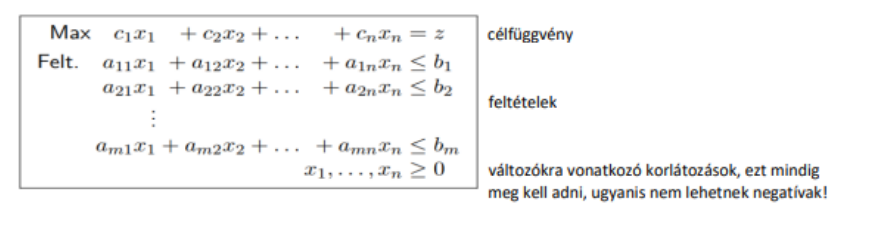

# LP

[Gyak](https://www.inf.u-szeged.hu/~kgelle/?q=opkuts)

Probléma: Keressük egy, a valós számok halmazán értelmezett célfüggvény szélsőértékét, úgy, hogy a célfüggvényben szereplő változókra különböző lineáris korlátokat határozunk meg.

## Geometriája

Szoros kapcsolatban áll a konvex geometriával

- R^n, n-dimenziós lineáris tér a valós számok felett, elemei az n elemű valós vektorok
- E^n, n-dimenziós Euklideszi-tér, olyan lineáris tér, amelyben értelmezett egy belső szorzat és egy távolságfüggvény
- Pont xE^n vektor
- Lehetséges megoldások: pontok ebben az n dimenziós euklideszi térben
- Lineáris feltételek: zárt félterek és síkok
- Lehetséges megoldások halmaza: ezen zárt félterek és síkok metszete, egy konvex poliéder
- Feltételek: poliéder lapok (egy lineáris célfüggvény valamely csúcsában veszi fel a szélsőértéket)
- Bázismegoldások, poliéder csúcsok

- Poliéder: zárt, véges sok csúcsponttal rendelkező ponthalmaz
- Konvex ponthalmaz: olyan ponthalmaz, amelynek ha vesszük két tetszőleges pontját, az azt összekötő szakasz összes pontja is a konvex ponthalmaz pontjai lesznek
- Zárt ponthalmaz: tartalmazza a pontjaiból képezhető tetszőleges konvergens sorozat határértékét is

Ahhoz, hogy az LP-nek legyen optimális megoldása, a lehetséges megoldások halmazának korlátosnak kell lennie. Az optimális megoldások halmaza konvex.

## Szimplex

- Felírjuk a korlátokat, majd minden sorban behozunk egy mesterséges változót.

- Ezután szótáralakra kell hozni a feladatot: a mesterséges változókat kifejezzük az egyenletekből (csak ők vannak az egyenlet egyik oldalán) A szótáralak egy bázismegoldást mutat, amely nem feltétlen az optimális megoldás. Onnan tudjuk, hogy egy megoldás optimális, ha a célfüggvényben nincs pozitív együtthatós változó.

- Ha nem találtuk meg az optimális megoldást, akkor generáló elemet választunk. Kell belépő és kilépő változót választanunk. A választáshoz gyakran hányadostesztet is kell végezni:
  - belépőváltozóból vesszük azokat, ahol negatív együtthatóval szerepel, itt a konstans értéket elosszuk az együttható abszolútértékével, ahol ez a legkisebb, azt a kilépőváltozót válasszuk

Generáló elemeket a következőképpen tudunk választani:

- Klasszikus: belépőváltozóból válasszuk ki azt, amely a célfüggvényben a legnagyobb pozitív együtthatóval rendelkezik, kilépőváltozónál hányadosteszt alapján választunk, ütközéskor a legkisebb indexű egyenletet

- Bland: belépőváltozónál a legkisebb indexűt válasszuk, kilépőváltozó ugyanaz

- Legnagyobb növekmény: hányadosteszt alapján válasszuk azt a belépőváltozót amelynél a legnagyobb értéket hozza létre a hányadosteszt

## Kétfázisú szimplex

A szótár eredeti alakja nem lehetséges, valamely korlát egyenletében a konstans negatív. Ilyenkor a szótáralakot kell átalakítanunk már egy olyan alakba amelyen a szimplex algoritmust tudjuk futtatni.

Megoldás: vezessünk be egy x0 változót minden egyenletben, és a célfüggvényünk ezt minimalizálni (azaz `-x0`-t maximalizáljuk).

Ezután ha bevezettük a bázisváltozókat, és felírtuk a feladatot szótáralakba, válasszuk ki a legnegatívabb jobboldalú egyenletet (legkisebb konstans van benne?), és fejezzük ki belőle x0-t. A többi egyenletből pedig a bázisváltozókat (ugyanúgy mint eddig).

A segédfeladatnak, azaz w-nek az optimumának 0-nak kell lennie.

A standard feladatban x0-t el kell tüntetni:

- ha x0 = 0, akkor csak elhagyjuk
- ha bázisváltozó, akkor pivotlépéssel keresünk egy nem 0 együtthatójú változót az egyenletében
- ezután elhagyjuk x0 előfordulásait

https://inf.u-szeged.hu/~kgelle/sites/default/files/upload/opkut-gyak-6_0.pdf

## Speciális esetek

- Ciklizáció-degeneráció: ha a bázismegoldás változói közül legalább az egyik értéke 0, akkor degenerált bázismegoldás, emellett degenerált iterációs lépésnek nevezzük azt, amikor az iterációs lépést követően nem változik a bázismegoldás értéke. Ez vezethet ciklizációhoz, amely esetben olyan szótárral találkozunk, amellyet egyszer már láttunk (ami miatt kerülhetünk végtelen ciklusba)

- Ha a feladatnak nincs optimális megoldása, az vagy nem korlátos, vagy nincs megoldása. Ha a lehetséges megoldások halmaza korlátos, az LP-nek van optimális megoldása. Úgy tudjuk megnézni, hogy korlátos-e a feladat, hogyha az összes lehetséges belépőváltozónk a korlátokban pozitív, akkor az nem korlátos feladat.
