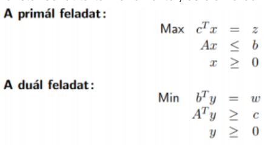

# Primál Duál feladatpár

Ha egy LP feladatnak van optimális megoldása, akkor van optimális bázismegoldása is.
Ezt a dualitás tételével tudjuk megerősíteni. A dualitás rugalmasabbá teszi az LP feladatok megoldását. Ha a feladatunkban sok a korlát, akkor az sok iterációval járhat. Az eredeti feladat lesz a primál, amely egyenletrendszerének alakja a

feladat lesz. Ez a gyakorlatban azt jelenti, hogy a primál feladat egyenleteinek ellentetjének oszlopai lesznek a duál feladatban a sorok (az együtthatói, a változók új, y változók lesznek), b és c vektorok szerepét felcseréljük, feltételeknél a relációs jeleket megcseréljük, és maximalizálási feladat helyett minimalizálási feladatunk van.

## Tételek:

A duál duálisa az eredeti primál. Egy mátrix transzponáltjának transzponáltja vissza adja az eredeti mátrixot. Mivel a duálist transzponálással kapjuk meg, ha kettőszőr transzponálunk ugyanazt kapjuk meg.

Gyenge dualitás tétele: c^Tx <= b^Ty, ha az x vektor egy lehetséges bázismegoldása a primálnak, és y vektor egy lehetséges bázismegoldása a duálnak. Ez a tétel miatt, ha a primál nem korlátos, akkor a duál se lehet az, amely miatt ha a primálnak nincs megoldása, akkor a duálnak sincs.

Erős dualitás tétele: c^Tx = b^Ty, x vektor egy lehetséges bázismegoldása a primálnak, és y vektor egy lehetséges megoldása a duálnak.

# Egészértékű Lineáris Programozás

https://www.inf.u-szeged.hu/~london/OpkutEA/opkut10handout.pdf

Az egészértékű lineáris programozásnál az LP-hez képest egy új feltétel jön be a változókhoz: ezek csak egész értéket vehetnek fel. Ilyen problémák például a hátizsák probléma, utazó ügynök probléma, stb..

- Az IP relaxáltja az az LP, ahol a változókra tett egészértékű megkötést eltöröljük.
- A relaxált LP optimuma nagyobb, vagy egyenlő az IP optimális megoldásától.
- Ha az LP optimális megoldáshalmazának csúcspontjai egészek, akkor az az IP optimális megoldása is.
- A relaxált LP optimális megoldása bármilyen messze lehet az IP megoldásától.

Az IP-t megoldhatjuk a Branch & Bound módszerrel, amely esetén vesszük a relaxált LP problémát, és annak egy változóját a szomszédos egészértékekre beállítjuk (pl. 3,4 esetén a 3-t és a 4-t.). Mivel ez kettő új részfeladatot eredményez, ezeket a fixált változókkal meg kell oldani, és újra a tört eredmény alapján megoldani, amíg el nem fogynak a tört változók. (Inkább nézd meg a jegyzetet).

# Hátizsák probléma

A hátizsák problémánál vannak tárgyaink, amelyeknek van súlyuk és értékük, illetve egy hátizsákunk, amelynek valamekkora kapacitása van.

A hátizsák problémából van a töredékes, amely esetén megengedjük, hogy egy tárgyat eltörjünk. Ennek megoldása egyszerű, vesszük a súly és érték arányát, ez alapján sorrendbe rakjuk a tárgyakat, és belepakoljuk azokat egészben, amelyek beleférnek. A maradék helyre a következő tárgyat törjük el, hogy feltöltse azt.

A törés nélküli hátizsák probléma, egy olyan IP probléma, amely esetén a változók azt jelölik, hogy beletesszük-e a táskába a tárgyat (1-essel), vagy nem (0-val). Ezt is a Branch & Bound módszerrel tudjuk megoldani pl. A probléma NP nehéz, ugyanis legrosszabb esetben 2^n megoldást kell megnéznünk.
