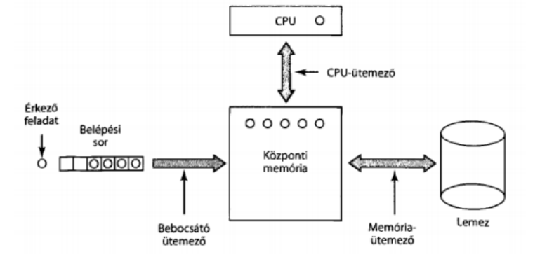

# Processzus (Process)

A processzus egy futó, végrehajtás alatt álló program. Ilyen processzusokhoz tartozik egy címtartomány, amely a processzus által felhasználható memóriaterületet írja le (a tartomány minimum- és maximum címével). Ez tartalmazza a betöltött progrmaot, az adatait és a vermét. Minden processzushoz tartozik egy regiszterkészlet, beleértve az utasításszámlálót, veremmutatót, egyéb hardverregisztereket és a program futásához szükséges egyéb információkat.

Egy hagyományos operációsrendszerben a futó processzus saját címtartománnyal és egyetlen vezérlési szállal rendelkezik. Azonban előfordulhat, hogy igényünk van több párhuzamosan futó processzusra, akár egy címtartományon belül.

A processzusok erőforrásokat is felhasználhatnak, ezek lehetnek gyermekprocesszusok, megnyitott fájlok, szignálkezelők, elszámolási információk, stb... Emellett a processzusnak van egy (vagy több) végrehajtási szála, amelyet szálnak szoktunk rövidíteni.

A processzus az erőforrások csoportosítása.

A processzustáblázat olyan memóriaterület, ahol a processzusok nyilvántartása és leírása található. Ennek a memóriarésznek fontos egysége a PCB (Process Control Block), amely tartalmazza a processzus azonosítóját, állapotát, a CPU állapotát az esetleges kontextuscseréhez, a jogosultságokat és a birtokolt erőforrások listáját.

A processzusok állapotai:

- futó: az adott pillanatban használja a CPU-t
- futáskész: ideiglenesen megállt egy másik processzus futása érdekében, de képes futó állapotba lépni (vagy előzetesen blokkolt állapotban volt)
- blokkolt: külső esemény, tényező miatt megakadt a futása, és arra vár, nem képes futó állapotba lépni

Egyszerű rendszereknél elegendő indításkor a szükséges processzusokat is elindítani, azonban általánosabb célű rendszereknél igény van processzusok indítására működés közben, és azok megszüntetésére a rendszer leállása előtt. A processzus létrehozását 4 fő esemény okozhatja:

- A rendszer inicializálása
- A felhasználó kezdeményezi
- Kötegelt feladat kezdeményezése
- A processzus által meghívott processzust létrehozó rendszerhívás

Az operációs rendszer indításával sok processzus indul, ezek sokszor az előtérben futnak, és ezek tartják fenn a kapcsolatot a felhasználóval, vagy munkát végeznek neki.

A háttérprocesszusok, amelyek nem tartoznak felhasználóhoz, saját feladatuk van és azt a háttérben végzik (ezek a daemonok, például használjuk webkérések kiszolgálására, service-k futtatására).

A futó processzusok is adhatnak ki rendszerhívásokat új processzus létrehozására. Például ha az elvégzendő feladat, több appró, egymástól függetlenül futtatható részfeladatra felbontható, akkor érdemes lehet azokat appró alprocesszusra bontani, ezzel akár párhuzamosítást is kihasználni.

A létrehozás lépései:

1. Memóriaterület foglalása a PCB-n, azaz a folyamatvezérlőtáblában
2. A PCB kitöltése kezdő adatokkal (pl. felhasznált erőforrások, jogosultságok a létrehozó jogosultságaiból)
3. Memóriafoglalás a program utasításainak, adatainak és a veremnek
4. A PCB processzusok láncára fűzése, azaz beütemezése a CPU órajelébe, így az elkezd osztozkodni a többi futó processzus mellett CPU-n

A processzus több okból is leállhat, ezek:

- Szabályos kilépés (önkéntes)

  A legáltalánosabb eset, ilyenkor a program teendői elfogynak, és azt jelzi az operációsrendszernek egy rendszerhívással (C programban return 0 a main függvényben)

- Kilépés hiba miatt (önkéntes)

  A program működése során hiba történt, amelyet a programozó idéz elő (C programban a main függvényben return 1)

- Kilépés végzetes hiba miatt (önkéntelen)

  Ilyenkor váratlan hiba történik a futás közben, amelyet a processzus nem kezel le, és így az operációsrendszer megszűnteti annak futását. (Pl. elfogy a memóriaterület, 0-val való osztás történik, C esetén segfault).

- Egy másik processzus megszűnteti (önkéntelen)

  Ilyenkor egy másik processzus idézi elő a kiválasztott processzus megszűntetését. Ez pl. lehet Windows esetén a taskkill, vagy Linux esetén a kill, killall parancsok. Ezekhez jogosultság is szükséges. Vannak bizonyos operációsrendszerek, ahol a szülő processzus megszűntetése / befejezte is okozhat elő ilyet, ugyanis ilyenkor a gyermekprocesszusokat is megszünteti az operációsrendszer.

Befejezés lépései:

1. A gyermekprocesszusok megszűntetése
2. A PCB-n a processzusok láncáról való levétel
3. A processzus birtokában lévő erőforrások felszabadítása
4. A processzus által lefoglalt memóriaterület felszabadítása
5. PCB-n lefoglalt memóraterület felszabadítása

# Szál (Thread)

A szál utasításszámlálója azért felel, hogy nyílvántartsa melyik utasítás következik. Regiszterei vannak, melyek az aktuális munka változóit tárolják. A hozzá tartozó verem tárolja a lokális változókat és a meghívott függvényeket, amelyekből még nem tért vissza a vezérlés.

Több ilyen szál segítségével van lehetőségünk egy processzuson belül több végrehajtást futtatni, amelyek egymástól többnyire függetlenek lesznek.

Ha ugyanazon a címtartományban több szál van, akkor egy különálló száltáblázatra van szükség szálankénti bejegyzéssel. A szálankénti bejegyzésben benne lesz az utasításszámláló, a regiszter és az állapot.

A szálakat van lehetőségünk felfüggeszteni, és folytatni. Ilyenkor a száltáblázatban eltárolt állapotot mentjük le és töltjük vissza, ezek megléte nélkül ezt nem tudnánk kivitelezni.

# Ütemezési stratégiák

Az operációs rendszer ütemezője az, amely eldönti, hogy mely processzus fusson, az ezt eldöntő algoritmust pedig ütemezési algoritmusnak hívjuk.

Időosztásos rendszerekben az ütemezés bonyolult, hiszen gyakran több felhasználó vár a kiszolgálásra és még kötegelt feladatsorok is lehetnek, vagy háttérfeladatok is hajtanak végre különböző műveleteket.

Ütemezésre akkor kerül sor, ha:

- Egy processzus befejeződött
- Egy processzus blokkolt állapotba kerül, pl. erőforrásra vagy szemaforra vár
- Új processzus jön létre
- I/O megszakítás történik
- Időzítőmegszakítás történik

Az ütemezési algoritmusok két csoportba oszthatóak az időzítőmegszakítások kezelésének vonatkozásában. Nem megszakítható ütemezés esetében az ütemező a kiválasztott processzust addig engedi futni, amíg az blokkolódik, vagy amíg az önszántából le nem mond a processzorról. Ezzel ellentétben megszakítható ütemezés esetében a processzus csak legfeljebb egy előre meghatározott ideig futhat.

# Ütemezési algoritmusok céljai

Minden rendszer:

- pártatlan, minden processzusnak megfelelő hozzáférést biztosítani a CPU-hoz
- a meghatározott elvek betartása, az alapján való működés
- egyensúly, a rendszer minden részének egyenletes terhelése

Kötegelt rendszerek:

- áteresztőképesség, maximalizálni az időegységenként végrehajtott feladatok számát
- áthaladási idő, minimalizálni a feladat-végrehajtás kezdeményezését és a befejezés között eltelt időt
- CPU-kihasználtság, a CPU soha nem állhat tétlenül

Interaktív rendszerek:

- válaszidő, a kérésekre gyors válasz biztosítása
- arányosság, a felhasználók elvárásainak való megfelelés

Valós idejű rendszerek:

- határidők betartása. adatvesztés elkerülése
- előrejelezhetőség, minőségromlás elkerülése multimédia-rendszerekbens

# Stratégiák kötegelt rendszerekben

## Sorrendi ütemezés

- legegyszerűbb
- olyan sorrendbe osztja ki, amilyenben kérik a processzusok
- futásra kész processzusok egy sorban várakoznak
- amikor az első feladat belép a rendszerbe, addig fut ameddig az szeretne
- amikor az végez, vagy blokkolódik, a következő feladatot veszi be a sorból
- ha egy blokkolt processzus újra futásra kész, akkor beáll a sor végére
- egyszerű leprogramozni
- hátránya, hogy a sokáig futó processzusok miatt a sor akár lassan haladhat, és más processzusok sokáig nem kerülnek futásra

## Legrövidebb futási idejűt előre

- feltételezzük, hogy a futási idők ismertek előre
- prioritási sorba rendezzük az algoritmusokat, a legrövidebb idejű algoritmust vesszük ki mindig
- ha a futó processzus hátralévő ideje több, mint az újonnan beszúrandóé, akkor az újat kezdjük el futtatni, a régit meg visszarakjuk a sorba

## Háromszintű ütemezés

- az újonnan beérkező feladatok először egy lemezen tárolt belépési várakozó sorba kerülnek

1. szint: bebocsátás

   - a bebocsátó dönti el, hogy mely feladatok léphetnek be a várakozó sorba
   - ezt vezérlő algoritmus a rövid feladatokat hamar, a hosszúakat később engedi be
   - vagy megpróbál egy olyan processzus-halmazt bebocsátani, amely egyszerre számításigényes és IO igényes, így kihasználni a rendszer leterheltségét (amíg az IO igényes processzusok várnak az erőforrásokra, addig a számításigényes tud dolgozni)
   - amint bebocsátásra kerül egy feladat, akkor jön létre számára egy processzus
   - ha túl sok processzus lenne, akkor azokat ki kell írni a lemezre

2. szint: memóriaütemező

   - melyik processzus marad memóriában, melyik kerül a lemezre
   - időnként felülvizsgálja, hogy legyen esélye a lemezen lévő processzusoknak visszakerülni a memóriába
   - következő szempontok kerülnek figyelembe:
     - mennyi idő telt el a processzus lemezre vitele óta?
     - mennyi cpu időt használt fel a processzus nemrégiben?
     - milyen nagy a processzus?
     - mennyire fontos a processzus?

3. szint: CPU ütemező
   - ő válassza ki mely processzusok futnak valójában

# Stratégiák interaktív rendszerekben

## Round Robin ütemezés

Legegyszerűbb, és legszélesebb körben használt algoritmus. Minden processzusnak ki van osztva egy időintervallum, amely alatt engedélyezett a futása. Ha elfogy az ideje, akkor visszakerül a sorba. Ha túl alacsony időt engedélyezünk a processzusoknak, a CPU több időt fog tölteni azok cseréjével, mintsem a processzusok futtatásával. Ha keveset, akkor nem lesz elég reszponzív az operációs rendszerünk, nem fog tudni az interaktív kérésekre válaszolni. Gyakori kompromisszum a 20-50 ezred másodperc.

## Prioritásos ütemezés

A processzusokhoz statikusan vagy dinamikusan prioritást osztunk. Azért, hogy a magas prioritású sorok ne foglalják le a teljes időszeletet, azok egy bizonyos idő után prioritást vesztenek, vagy pedig minden processzus egy maximális időszelet alatt futhat. A prioritási osztályokon belül pedig gyakran round robin ütemezést használnak.

## Többszörös sorok

Megpróbál a CPU igényes processzusoknak inkább nagyobb időszeletet adni, mert azok úgyis sokáig futnak, így nem kell annyiszor a lemezre írni azt.
Viszont, ez lehet hogy gyenge válaszidővel jár. Ez miatt prioritási sorokat állítunk be. A magas osztályban lévők 1 időszeletet kapnak, a következő 2-t, utána lévő 4-et, és így tovább, a kettő hatványaival. Ezzel megvédjük azokat a processzusokat, amelyek kezdetben sokáig töltenek, de utána interaktívvá válnak.

## Legrövidebb processzus következzen

Ez alapján becsléseket végzünk a korábbi viselkedés alapján, és a legkisebb becsült futási idejű algoritmust vesszük előre. A becslést az alapján végezzük, hogy a jelenlegi becsült értékhez és az utolsó futási időnek vesszük a súlyozott átlagát.

## Garantált ütemezés

- n darab felhasználó mellett, minden felhasználó ugyanannyi szeletet kap a CPU-ból, azaz 1/n mennyiséget.
- Ehhez méri, hogy egy processzus mennyi CPU-t kapott létrehozása óta és mennyit használt el, mennyi a neki járó mennyiség, és a felhasznált idő, illetve a neki járó idő arányát
- az a processzus kerül előre, amelynek a legkisebb az aránya

## Sorsjáték-ütemezés

- Véletlenszerűségre van bízva az ütemezés
- Sorsjegyet osztunk a processzusoknak a különböző erőforrásokhoz
- Döntéshozatalkol véletlenszerűen választunk egy sorsjegyet, és az a processzus fog az erőforráshoz hozzáférni
- Processzusok több sorsjegyet is kaphatnak, ezzel előnyt adva a fontosaknak

## Arányos ütemezés

- Figyelembe veszi a processzus tulajdonosát
- Megadott arányok szerint felossza a CPU-t
- Ha az első felhasználónak ABCD processzusai vannak a másodiknak E, 50-50 arányban férnek hozzá a CPU-hoz, akkor Round Robinnal a következő egy érvényes sorozat: AEBECEDE

# Stratégiák valós idejű rendszerekben

Valós idejű rendszerben a számítógépet fizikai eszközökön keresztül "ingerek" érik, amire reagálnia kell egy megfelelő időn belül. Sok esetben egy ilyen rendszernél nagyon kritikus a válaszidő, pl. egy robotpilótánál.

2 csoportja létezik: szigorú és toleráns (szigorúnál elfogadhatatlan a késés, toleránsnál vállalható, de nem kívánatos)

Események csoportotsítása: periodikus (ismétlődő, rendszeres, kiszámítható) és aperiodikus (megjósolhatatlan, váratlan). Attól függően mennyi ideje van kezelni az eseményeket előfordulhat, hogy nem tudja mindet.

Ütemezhetőek azok a valósidejű rendszerek, amelyek ezeket a feltételeket teljesítik. Ezek algoritmusai lehetnek statikusak vagy dinamikusak. A dinamikus a döntéseket futás közben, a statikus már futás előtt meghozza.
A statikushoz azonban szükséges, hogy ismerjünk minden tényezőt előre (elvégzendő feladatok, határidők). Dinamikusnál ez nem szükséges.

# Kontextuscsere

Ha egyetlen CPU áll rendelkezésre, akkor a CPU váltakozva hajtja végre a processzusokat. Kontextuscserénél a CPU a P1 processzusról átvált a P2 processzus futására. Ekkor P1 állapotát a regiszterekből átmenti a memóriába, majd P2 állapotát a memóriából áttölti a regiszterekbe. Azonban kontextuscserére nem csak egy processzoros rendszerekbe, hanem többprocesszorosoknál is szükség van.
