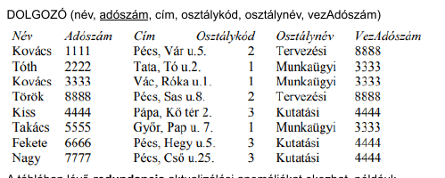
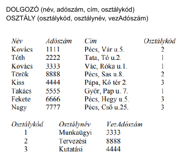
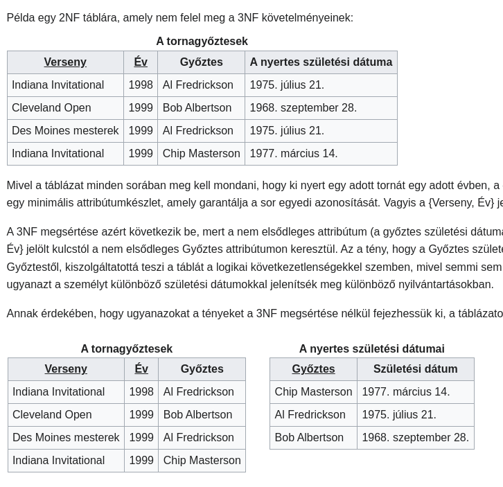

# Adatok típusai

- Egyszerű (atomi): szám, szöveg, dátum, logikai
- Összetett: egyszerű vagy más összetett adatból képezhető
  - halmaz: elemek egynemű rendezetlen halmaza
  - lista: elemek egynemű rendezett sorozata
  - struktúra: különféle elemek, fix hosszú rendezett sorozata
- NULL: definiálatlan adat, ezzel jelöljük, ha az érték hiányzik

# Elnevezések

- Adatbázis (DB), adott formátum és rendszer szerint tárolt adatok együttese
- Adatbázis-kezelő rendszer (DBMS = Database Management System), az adatbázist kezelő szoftver
- Rekord, relációs adatbázis alapvető egysége, struktúra felépítésű

# Adatbázis alkalmazás szintjei

- Felhasználói felület
- Célalkalmazásként készített program
- Adatmodell (logikai adatstruktúra)
- DBMS
- Fizikai adatstruktúra

# Relációs adatmodell

Az adatbázist az adatok közti kapcsolatok alapján struktúráljuk. Az ugyanolyan struktúrájú adatokat adattáblákba szervezzük, amely oszlopból és sorokból áll. Egy sorja a táblának a rekord, amely annyi mezőből áll, ahány oszlopa van a táblának. Az oszlopok írják le ezen mezők tulajdonságait.

## Relációséma

Attribútumhalmaz, amelyhez azonosító nevet rendelünk, R(A1, A2, ..., An) a jelölése, R a relációséma neve, Ai egy attribútum.

## Attribútum

Az attribútumoknak meghatározott értéktartománya van, pl. az A attribútum értéktartománya a dom(A).

## Szuperkulcs

Azt a K attribútum halmazt nevezzük szuperkulcsnak, amelyen a T tábla minden sora garantáltan különböző értékeket vesz fel.

## Kulcs

Az A attribútumhalmaz K részhalmazát kulcsnak nevezzük, ha minimális szuperkulcs, vagyis egyetlen valódi részhalmaza sem szuperkulcs. Ha K egyetlen attribútumból áll, akkor egyszerű, egyébként összetett kulcs.

## Elsődleges kulcs

A kulcsok közül kiválasztunk egyet, amely elsődleges kulcs lesz, amelyet aláhuzással jelölünk.

## Külső kulcs

Olyan attribútum, amely egy másik séma elsődleges kulcsára hivatkozik, értéke ezen séma elsődleges kulcsait veheti fel. Ezt dőlt betűvel szokás jelölni, vagy a hivatkozott kulcsra mutató nyíllal.

# Egyed kapcsolat (ER) diagram

Egyed-kapcsolat diagram az adatok logikai modelljét és azok közti relációt mutatja meg. Ezek elemei:

- Egyed (entity): egy objektum a fizikai vagy elméleti térben, pl. ember, jármű, munkahely (téglalap)
- Attribútum: az egyed egy jellemzője (ellipszis)
- Kapcsolat: egyedek közt határoz meg kapcsolatot (rombusz)
- Összetett attribútum: maga is attribútumokkal rendelkezik
- Többértékű attribútum: aktuális értéke halmaz vagy lista (kettő ellipszis)
- Gyenge egyed: kapcsolataival együtt határozható meg egyértelműen, jele kettős téglalap
- Meghatározó kapcsolat: meghatároz egy gyenge egyedet, jele kettős rombusz
- Specializáló kapcsolat: hierarchiát jelöl az egyedek közt (jele háromszög, melynek csúcsa a főtípus felé mutat)

# ER diagram relációs modellre

Az egyedekhez létrehozunk egy relációsémát, ennek attribútumait felvesszük a diagramból, és választunk egy elsődleges kulcsot (ha azt a diagram nem határozza meg)

Gyenge entitások esetén relációsémát bővíteni kell a meghatározó kapcsolatban szereplő egyedek kulcsaival.

Összetett attribútum: összetett attribútumokat a részattribútumaival helyettesítjük

Többértékű attribútum: külön relációsémát hozunk létre az attribútummal és az egyed kulcsával

# Funkcionális függőség

Ha A1 attribútum értékét A2 attribútum értéke alapján meg tudjuk határozni, akkor A1 attribútum funkcionálisan függ A2-től.

# Normalizálás

Normalizálni azért kell a relációssémákat, hogy minnél kevesebb adatot tároljunk redundánsan, ugyanis semmi nem garantálja azt, hogy mi optimális modellt hoztunk létre az ER diagrammal.

Példa egy optimalizálatlan és optimalizált relációssémára:

## 1NF

A relációsémák egyszerű, atomi elemeket tartalmaznak.
Összetett struktúrákat elemeire kell bontani, listákat és halmazokat pedig segédtáblába kell szervezni. A lista elemeit az egyed kulcsával kell párban eltárolni a táblában.

## 2NF

ZV kidolgozásból jobban érthető.

## 3NF

Nincsenek funkcionális függőségek nem-kulcs attribútumok közt, hanem mindegyiknek kulcstól kell függenie.

Itt

Verseny->Győztes->Győztes születési dátuma

Tranzitív függés!
