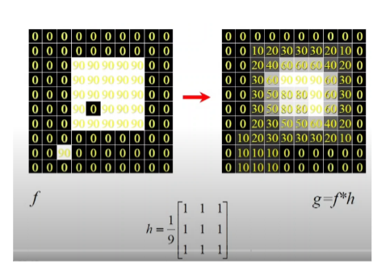
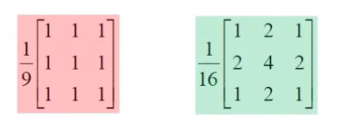
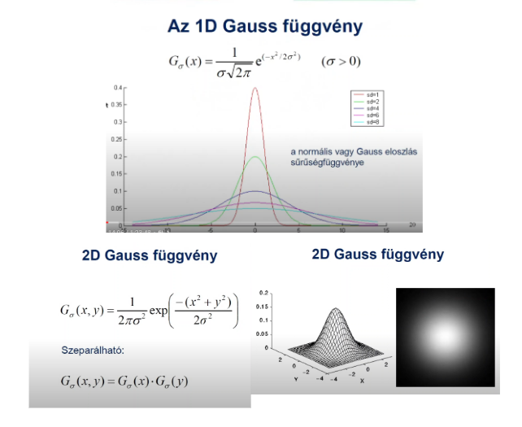
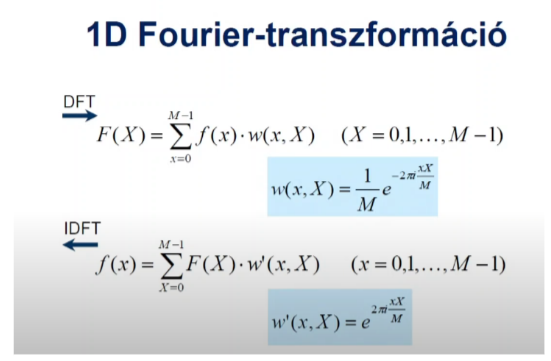
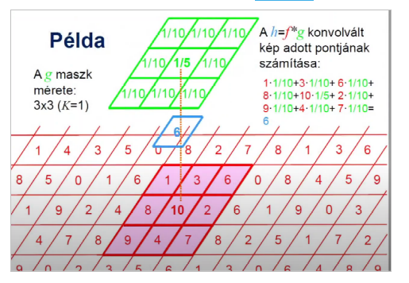
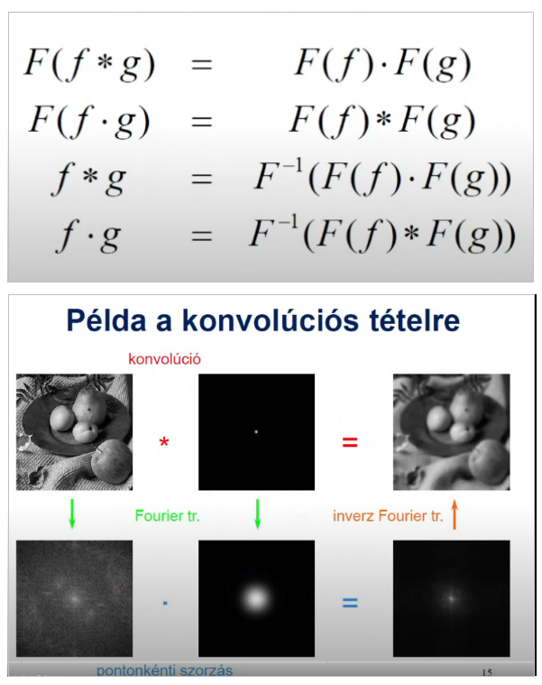
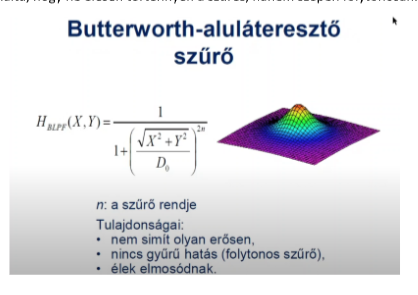
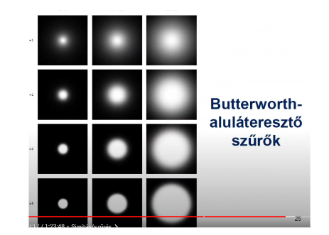
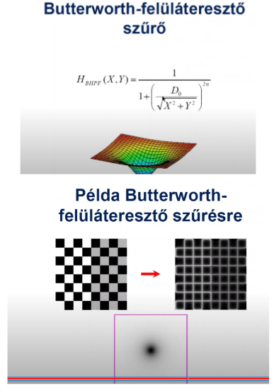
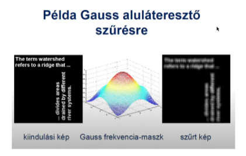

Szűrés képtérben (átlagoló szűrő, Gauss-simírás, medián- és min-max szűrés) és frekvenciatérben (konvolúciós tétel, az alul- és felül-áteresztő szűrés frekvencia-maszkjai)

https://drive.google.com/file/d/1Lvy_AzAmOBWpfL1gD6WZ0vS3FRLvvNHY/view

# Szűrés képtérben

Rasztergrafikus képet képpontok vagy pixelek építenek fel, melyeket mátrixszerűen rendezünk el. A képről ezen pixelek színeit tároljuk el, tömörítés nélkül minden pixel 24 bitet tárol, 3 színcsatorna (RGB), 8 bit minden színcsatornához. Ez a képtér.

## Átlagoló szűrés

Simítás: a zajt csökkenti, pl. emberi felületen sminkelésre lehet használni, ilyen az átlag meg a súlyozott átlag szűrés.

Minden képpont veszi a környezetét, (pl. 3x3-as), és kiszámolja az átlag intenzitást, ez lesz az új intenzitás.

Az átlagolást konvolúcióval érhetjük el, a környezet méretével egyenlő konvolúciós maszkkal. A konvolúciós maszkon a képpontok összegének 1-nek kell kijönnie, egy képpont pedig a maszk képpont darabszámainak reciproka (szóval 3x3-as környezet esetén, 3x3 = 9, tehát egy képpont a konvolúciós maszkon 1/9 lesz, 5x5-ös esetén 1/25 lenne).

Átlagszűrés:



Érdemes Gauss zaj mellett használni

## Gauss szűrés

A súlyozott átlagszűrés esetén a közelséget vesszük a környező képpontok súlyának, minnél közelebbi képpontról beszélünk, annál nagyobb súlyt kap. Ez esetben a konvolúciós maszkban különböző értékeket használunk. Ilyen súlyozott átlagoló szűrés a Gauss függvény által meghatározott szűrő is, amely a Gauss simítás. A súlyozott átlagszűrő maszk elemeinek összege is 1-re jön ki.

Normál és Súlyozott átlagszűrő



Gauss függvény

## Rank szűrők

Medián, min, max, azaz statisztikai szűrők tartoznak ide

## Medián szűrés

Egy S méretű környezetben vesszük az értékek mediánját, és ez lesz az új intenzitása a képpontnak. Só-bors zaj szűrésre tökéletes

## Min és max szűrő

Egy képpontS méretű környezetében a legkisebb vagy a legnagyobb képpont intenzitása lesz az új képpont intenzitása

Min szűrés esetén ez erózió, max szűrés esetén dilatáció

Morfológiai szűréshez használjuk, ez esetben ez erózió, dilatáció, dilatáció, erózió



# Frekvenciatér

a kép Fourier transzformált párja



## Konvolúció

Az a folyamat, amely esetén kettő képet vagy jelet polinom szorozzuk.

Pl.

```

ha f jelsorozat 10, 20, 40, 30, 50, 30, 80
és g konvolúciós jelsorozat maszk pedig 1/3, 1/3, 1/3

és h az eredmény

akkor h(i) = f(i-1) * g(i-1) + f(i) * g(i) + f(i+1) * g(i+1)

```

2D-ben:



A konvolúciót a képtérben lassabb elvégezni, mint a frekvenciatérben, ugyanis ha vesszük mindkét jel Fourier transzformáltját, azokat pontonként összeszorozzuk, és vesszük az eredmény inverz Fourier transzformáltját, megkapjuk szintúgy a konvolúció eredményét.



## Felül és aluláteresztő szűrők

Ideális Aluláteresztő: simít, egy D sugarú körben megtartjuk a frekvenciákat (fehér pontok), ami kívül van, azok elnyelődnek (fekete pontok), ezzel kapunk egy szűrő maszkot. Az éles levágás miatt hullámzások jelennek meg. Minnél kisebb a D sugarú kör, annál homályosabb képet kapunk.

Ideális felüláteresztő: az aluláteresztő inverze, itt a D sugarú körben fekete képpontok vannak, kint pedig a fehér pontok. Az éles levágás miatt is megjelennek hullámok. A képtérben az éleket fogja megerősíteni.

Ideális sáváteresztő: kombináljuk az alul és felüláteresztőt, fehér képpontok egy gyűrűben vannak, a többi képpont itt is fekete.

Ideális sávletiltó: inverz gyűrű (fehér képpont a gyűrűn kívül, fekete a gyűrűben), zajos képre használható

Butterworth aluláteresztő: átmenetes a D sugarú kör, így nem lesz hullámos az eredmény.




Butterworth felüláteresztő: szintúgy hullámok ellen a felüláteresztésnél



Gauss aluláteresztő: a Gauss függvényt használjuk az aluláteresztő maszk átmenetének létrehozására.


