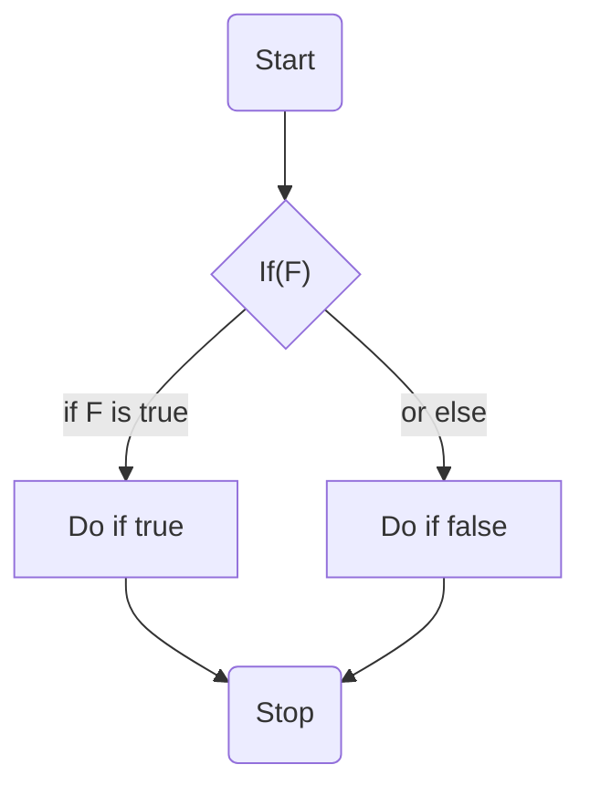

# Algoritmusok vezérlési szerkezetei és megvalósításuk C nyelven

Az algoritmus egyik legfontosabb tulajdonsága, a leírása, amely megmondja annak vezérlését, leírja a végrehajtás lépéseinek sorozatát.

Ezeket többféleképpen tehetjük meg:

- természetes nyelv: szövegesen, mondatokban foglalva írjuk le, legközelebb az emberi nyelvhez, legtávolabb a végrehajtó egységtől
- pszeudókód: programozási nyelvhez közeli leírás, de emberi szemnek készül
- folyamatábra: grafikus, kevésbé struktúrált gráf, a folyamatra koncentrál
- szerkezeti ábra: grafikus, struktúrált leírása az algoritmusnak, leírja a működési folyamatot

## Szekvenciális vezérlés:

P problémát több részproblémára bontjuk, és azokhoz létező algoritmusokat, egymás után, szekvenciálisan futtatjuk

Példa program: számoljuk ki egy derékszögű háromszög főátlóját a két befogó alapján

Megoldás:

```
main:
    a = read()
    b = read()
    c = sqrt(a * a + b * b)
    print(c)

```

```c
#include <stdio.h>
#include <math.h>

int main() {
    float a, b;

    scanf("%f", &a);
    scanf("%f", &b);

    float c = sqrt(a*a + b*b);

    printf("%f", c);
}
```

## Szelekciós vezérlés:

- egyszerű (if-else)
- többszörös (if-else if-else if...-else)
- esetkiválasztós (switch-case)



Példa feladat:

Signum függvény (meghatározni egy szám előjelét, ha mínusz, akkor -1-et visszaadni, ha 0 akkor 0-t, ha pozitív akkor +1-et)

```
sign(x):
    if x < 0:
        return -1;
    else if x > 0:
        return 1;
    else:
        return 0;
```

```c
int sign(int x) {
    if (x < 0) {
        return -1;
    } else if(x > 0) {
        return 1;
    } else {
        return 0;
    }
}
```

## Eljárásvezérlés:

Egy (rész)algoritmust adott argumentumokra alkalmazunk, aminek hatására a részalgoritmusunk jól meghatározott válasszal tér vissza (return)

Két fajtája a függvényművelet és az eljárás művelet. C-ben csak függvényt tudunk létrehozni, azonban van lehetőségünk azt úgy kezelni, mintha eljárásművelet lenne.

### Eljárásművelet:

Olyan eljárások sorozata, amely hatására a megadott paraméterek változnak, nem pedig eredménnyel tér vissza
C-ben ehhez void típusú függvényt kell létrehoznunk, amely pointerként várja az ilyen paramétéreket, így van lehetősége azok értékeinek megváltoztatására.

### Függvényművelet:

Egy függvény egy részprobléma leírásáért felel, amely jól paraméterezhető, és többször is meghívható.

Függvények a következő elemekből állnak:

- a függvény neve
- a visszatérési érték típusa
- paraméterek és azok típusai
- az utasítások sorozata, amelyet a függvény meghíváskor elvégez

### Mellékhatás:

Függvények mellékhatása az, amikor nem csak a függvény lokális változói változnak, hanem akár globálisak, akár pointerrel átadott változók értékei is, vagy például kiíratás történik.

### Előnyök:

Függvényekkel ismétlődő kódrészleteket tudunk kiszervezni, azokat el tudjuk izolálni a programkód többi részétől, ezzel könnyebben tesztelhető és karbantartható alkalmazásokat tudunk készíteni.
A függvény lokális változói is a függvény végrehajtásáig élnek, így a program memóriaigényét is tudjuk csökkenteni.

## Ismétléses (iterációs) vezérlés

Ismétléses vezérlést ciklusokkal tudunk végrehajtani. Minden ciklusnak van egy ciklusmagja, amely utasítások sorozatát tartalmazza, amelyet végrehajt.

Következő képpen tudunk ciklusokat végrehajtani:

### Kezdőfeltételes (while)

A ciklusmag végrehajtása előtt leteszteljük, hogy igaz-e a feltételünk. Ha igen, akkor végrehajtjuk a ciklusmagot, ha nem, akkor a ciklus utáni részével folytatjuk. Ha a feltételünk a legelső végrehajtáskor nem igaz, akkor soha nem fut le a ciklusmag.

### Végfeltételes (do-while)

A ciklusmag végrehajtása után leteszteljük, hogy igaz-e a feltételünk. Ha igen, akkor ismételten lefuttatjuk a ciklusmagot, ha nem, akkor tovább fut a kódunk. Akkor is egyszer lefut a ciklusmag, ha kezdetben nem igaz a feltétel.

### Számlálos (for)

A while ciklus kiegészítése, megadhatunk egy kezdőutasítást a ciklusnak, és egy utasítást, amelyet a ciklusmag végén mindig lefuttat. Általában ez egy számláló létrehozása, és annak léptetése.

```c
int i = 0;
while (i < n) {
    printf("%d\n", i);
    i++;
}

for (int i = 0; i < n; i++) {
    printf("%d\n", i);
}
```

### Hurok

Ismétléses ciklus, a ciklusmagon belül adjuk meg az utasítást (break), amely kilép a ciklusmagból.

### Diszkrét (foreach, C-ben nincs)

Egy kollekción (tömb, halmaz, lista, bármely más adatszerkezet) elemein iterál végig, és a ciklusmagban elérhető az éppen aktuális elem.
C-ben ilyen nincs, helyette számláló ciklussal kell a tömb indexein végigmenni, és kiolvasni az `i.` elemet.

```
int array[] = {1, 2, 3, 4};
int arraySize = 4;
for (int i = 0; i < arraySize; i++) {
    int element = array[i];
}

// modernebb nyelvekbe
int array[] = {1, 2, 3, 4};
foreach (int element in array) {

}
```
