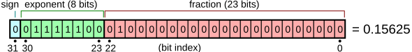

# Egyszerű adattípusok

Az adattípus olyan egysége a programnak, amelynek létezik egy értékhalmaza és műveletek listája, amely azon az értékhalmazon elvégezhető.

Minden adattípus vagy elemi, vagy más adattípusokból képzett, összetett típus.

C-ben az adattípusok méretét elérhetjük a `sizeof` operátorral.

Mivel az adatokat a memóriában tároljuk, ezért fontos megemlíteni annak felosztását. A programkódunk nagy részben kettő fontos memória területen dolgozik, az egyik a stack, mely a lokális változókat tárolja. Ennek mérete szűkös. A másik a heap, mely az egész memóriaterület (operációs rendszer ossza ki a futó processusoknak), jóval nagyobb memóriaterület. C-ben egyedül a stack a managelt memória terület, a heap managelése a programozóra van bízva (azaz a lefoglalt memóriaterületet manuálisan fel is kell oldanunk).

## Egész szám

Egész számtípusból sok létezik a C nyelvben. Fő különbségük köztük a memóriában elfoglalt hely, és az, hogy előjeles-e vagy sem (azaz tud-e negatív értéket felvenni).

Minnél több helyet foglal a memóriában egy szám, annál nagyobb értékhalmazt tud reprezentálni.

Ha a végzett műveletek az adott értékhalmazból kifutnak, akkor alul- vagy túlcsordulás fordulhat elő. Ez azt jelenti, hogy ha az értékhalmaz legnagyobb értékéhez mégegyet hozzáadunk, akkor a legkisebb értéket kapjuk meg, és ha a legkisebbből kivonunk egyet, akkor a legnagyobbat kapjuk meg.

### Egész típusok C-ben

| név                | hossz       | előjeles | értékkészlet                                             |
| ------------------ | ----------- | -------- | -------------------------------------------------------- |
| unsigned char      | 8 bit       | nem      | [0, 255]                                                 |
| unsigned short     | 16 bit      | nem      | [0, 65 535]                                              |
| unsigned int       | 16 v 32 bit | nem      | [0, 65 535] vagy [0, 4 294 967 295]                      |
| unsigned long      | 32 bit      | nem      | [0, 4 294 967 295]                                       |
| unsigned long long | 64 bit      | nem      | [0, 18 446 744 073 709 551 615]                          |
| signed char        | 8 bit       | igen     | [-128, 127]                                              |
| short              | 16 bit      | igen     | [-32 768, 32 767]                                        |
| int                | 16 v 32 bit | igen     | [-32 768, 32 767] v [ -2 147 483 648, 2 147 483 647]     |
| long               | 32 bit      | igen     | [ -2 147 483 648, 2 147 483 647]                         |
| long long          | 64 bit      | igen     | [-9 223 372 036 854 775 808, 9 223 372 036 854 775 807 ] |

### Műveletek

| művelet neve                                         | szintaxis |
| ---------------------------------------------------- | --------- |
| előjel váltás, ellentet                              | -x        |
| összeadás                                            | x + y     |
| kivonás                                              | x - y     |
| szorzás                                              | x\*y      |
| osztás (egész)                                       | x / y     |
| modulo (osztás maradékja)                            | x % y     |
| egyenlőség                                           | x == y    |
| nem egyenlőség                                       | x != y    |
| kisebb                                               | x < y     |
| kisebb v egyenlő                                     | x <= y    |
| nagyobb                                              | x > y     |
| nagyobb v egyenlő                                    | x >= y    |
| bináris és                                           | x & y     |
| bináris vagy                                         | x \| y    |
| bináris xor                                          | x ^ y     |
| bináris negálás                                      | ~x        |
| jobbra tolás (bináris utolsó y számjegyét elhagyjuk) | x >> y;   |
| balra tolás (binárist hátulról megtoljuk y 0-val)    | x << y;   |

### Karakter

Karakter tárolásához a `char`, `signed char` és az `unsigned char` típusokat tudjuk használni. Mindegyik 8 biten tárolja a karaktereket. A C szabvány nem szabja meg alapvetően, hogy a `char` típus előjeles-e vagy sem.

Ha megnézzük, ugyanezt a típust az egész számok tárolásánál is láthattuk. Ennek az az oka, hogy a karaktereket a memóriában számként ábrázoljuk, és valamilyen karaktertábla vagy kódolás alapján oldjuk fel, milyen karaktert reprezentál pontosan, alap esetben ez az ASCII kódolás. Megjegyzésként, modernebb nyelvek a karaktereket nem 8, hanem 16 biten tárolják, és UTF8 kódolást használnak.

### Logikai érték

Alapvetően a C nyelv nem használ külön logikai típust, hanem akármely más típus 0 értékét határozza meg a hamis értéknek, és minden más értéket pedig az igaznak. Azonban a C99-es szabvánnyal bejött a `bool` típus, amely 8 biten false (0) és true (1) értékeket tud felvenni, de ehhez szükséges használni az `stdbool.h` headert.
A logikai értéket elég lenne 1 biten is tárolni, azonban a modern architektúrák minimum 8 bittel tudnak csak dolgozni, emellett pedig a C-ben sem létezik beépítve 8 bitnél kevesebb memóriaterülettel dolgozó típus.

### Lebegőpontos számok

Lebegőpontos, vagy valós számok azok, amellyel van lehetőségünk tört részt is csatolni a számunkhoz.



| típus       | hossz                                                                         | felépítése                                       |
| ----------- | ----------------------------------------------------------------------------- | ------------------------------------------------ |
| float       | 32 bit                                                                        | 1 bit előjel, 8 bit kitevő, 23 bit szignifikáns  |
| double      | 64 bit                                                                        | 1 bit előjel, 11 bit kitevő, 52 bit szignifikáns |
| long double | fordító program függő (x86-on 80 bit, modernebb fordító programok esetén 128) |                                                  |

32 bites float esetén:

```

b(i) = szignifikáns i. bite (1-től számozva)
törtrész = 1 + sum[i = 1->23]( b(23-i) * 2^-i )

érték = (-1)^(előjel) * 2^ (kitevő - 127) * törtrész
```

A lebegőpontos számok nem pontosak, például az egész híres 1.0 + 2.0 = 3.00000000004

# Összetett típusok

## Pointer

A pointer egy bizonyos memóriacímre mutat. Pointerrel van lehetőségünk függvények közt változóba írni. Speciális értéke a NULL, amellyel azt jelezzük, hogy a pointer épp semmilyen memóriacímre nem mutat.

Műveletek:

| név          | magyarázat                                 | szintaxis |
| ------------ | ------------------------------------------ | --------- |
| dereferencia | x pointer által mutatott memóriacím értéke | \*x       |
| cím lekérése | x változó memóriacímének lekérése          | &x        |

Példa kód:

```c
int *x; // x pointer létrehozása
int y = 2; // y változó létrehozása

x = &y; // x legyen egyenlő y változó memóriacímével, azaz x mutasson y változóra

printf("%d", *x); // írjuk ki az x által mutatott változó értékét (2)
*x = 3; // felülírja y értékét is
printf("%d", y); // írjuk ki y változó értékét (3)
```

## Statikus tömb a stacken

Olyan adattípus, amely nem egy, hanem több, ugyanolyan típusú változónak foglal le a memóriában folytonos területet. Alapvetően a tömböt a stacken hozzuk létre. Ilyenkor a régi C fordítók megkövetelik, hogy már fordítás időben legyen ismert a tömb mérete (mivel a stack viszonylag a memóriaterület nagyon szűkös része, ezért nem is ajánlott).

A tömb i. elemét van lehetőségünk kiolvsani, illetve írni, ezt az i számot hívjuk az elem indexének. A tömbök indexelése a C nyelvben 0-tól kezdődik.

```c
int a[10]; // 10 elemű tömb létrehozása

for (int i = 0; i < 10; i++) {
    a[i] = i + 1; // a tömb feltöltése 1-10-ig
}
```

A tömb esetén az a változó mindig az első elemre mutat. i. elem kiolvasása úgy történik, hogy `a` memóriacíméhez hozzáadunk `i * a típus méretét`, ezzel megkapjuk az i. elem memóriacímét, és az azalatt található értéket.

## Dinamikus tömb

A dinamikus tömb annyiban különbözik az előbb említett statikus tömbtől, hogy az nem a stack-en, hanem a heap-en található. Azért dinamikus, mert a méretét nem kell ismernünk fordításídőben, az függhet akár felhasználó által megadott számtól is.

Dinamikus tömbhöz muszáj pointert használnunk. Létrehozni a `malloc` függvénnyel tudjuk, mely megadott méretű memóriaterületet foglal le, és visszaad egy pointert, mely ezen memóriaterület elejére fog mutatni.

A lefoglalt memóriaterületet a `free` függvénnyel tudjuk felszabadítani. A modern operációs rendszerek kiszűrik a memory leak-et a processzus élete végén, de ez nem minden rendszeren van garantálva, emellett a program élettartama

Példa kód:

```c

int n;
scanf("%d", &n); // a felhasználótól függ, mekkora méretű tömböt hozunk létre

int* array = malloc(sizeof(int) * n); // 10 elemű int tömb

for (int i = 0; i < n; i++) {
    a[i] = i + 1; // a tömb feltöltése 1-n-ig
}

// program...

free(array);
```
