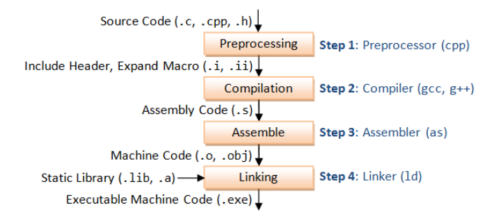

Java és C++ programok fordítása és futtatása. Parancssori paraméterek, fordítási opciók, nagyobb projektek fordítása. Absztrakt-, interfész- és generikus osztályok, virtuális eljárások. A virtuális eljárások megvalósítása, szerepe, használata.

# Cél

A Java és a C++ nyelv is fordított nyelv, azonban a lefordított állomány formátuma teljesen különbözik.

C++-t többnyire gépi kódra fordítjuk (clang tud LLVM-re fordítani), amelyet egyből tud az operációs rendszer futtatni (szinte) bármilyen segédprogram nélkül (pl. C++-ban készült játékok esetén gyakori függőség a DirectX és a Visual C++, amely nélkül nem indul).

Java-t JVM-ben futtatható bájtkódra fordítunk. A JVM a Java Virtual Machine, amelynek a célja, hogy egy gépet imitáljon saját utasításkészlettel, amelyet minden gépre és operációsrendszerre csak egyszer valósítanak meg, ezáltal lehetővé téve, hogy az összes Java programot elég legyen csak egyszer leprogramozni és lefordítani. Persze ezzel a platformok által adott különbségeket nem oldottuk meg 100%-ban.
A JVM-et a JRE (Java Runtime Environment) magába foglalja (ez Java programok futtatásához szükséges program), illetve a JDK (Java Development Kit), amely már fejlesztéshez szükséges eszközöket, könyvtárakat is tartalmaz.

## Java program futtatása és fordítása

Java programot a javac paranccsal fordítunk, de mivel az nem gépi kód lesz, hanem Java bájtkód, ezért azt a java parancs segítségével futtatjuk (mintha egy script lenne, pl. python, amelyet szintúgy a saját paranccsával tudunk futtatni, azonban ez egy alacsony szintű, ember számára épp nehezen olvasható)

javac pelda.java
java pelda

Fordításhoz megadható egyéb argumentumok:

```
-g: debug információk
-s <könyvtár>: generált fájlok könyvtárának megadása
-sourcepath <útvonal>: forrásfájlok elérési útvonala
-Werror: figyelmeztetés esetén megáll a fordítás
```

A legtöbb fejlesztői környezet (IDE) ezt a folyamatot kellőképpen leegyszerűsíti, és akár alap konfigurációkkal is egy kattintással futtathatunk Java programokat. Belépési pontja egy átlag Java programnak a main függvény.

C++ egy olyan nyelv, melyhez több fordítóprogram is tartozik. Ilyen pl. a g++ és a clang. g++ kapcsolói:

```
-Wall: kiír minden warning-ot fordításkor
-O<szint>: optimalizálási szint
-o <output>: output exe meghatározása
-g: GNU debugger információkat rak a fordított állományba
```

C-ben a belépési pont a main függvény.

```c++

// ./program.exe 1 2 3

// program.cpp
int main(int countOfArguments, const char** args) {
    // args[0] // ./program.exe
    // args[1] //  1
    // args[2] //  2
    // args[3] //  3

    return 0; //  kilépési kód
}
```

C++ program fordításának lépései:



Sok IDE lehetőséget ad egyszerűen nagy projekteket fordítani, azonban szükség lehet IDE-k közti működést is megvalósítani (pl. egy csapatnak szükség lehet, hogy vegyesen használhassanak IDE-ket). Erre megoldás a Maven, Gradle Java esetén, C++ esetén a Makefile és a Visual Studio megoldása, amelyet az IDE nélkül is lehet használni (Unreal Engine használja pl.).

# Absztraktosztályok, interfészek

20-as tételben

# Virtuális eljárások

Minden metódusnak van egy címe, ahhoz hogy egy sor meghívjon egy metódust szüksége van a címére. Ennek a címnek a feloldását virtuális eljárások esetén futásidőben tesszük meg. Javaban csak virtuális metódusok, eljárások léteznek, (kivéve a private és a final metódusokat), ennek oka a polimorfizmus megvalósítása.

C++-ban alapvetően a `virtual` kulcsszó kiírása nélkül nem lesznek virtuálisak a metódusok. Ha egy metódus virtuális lesz, akkor létrehozódik egy entry a VFT-ben (Virtual Function Table). Ez a VFT tárolja a példányok virtuális metódusait, erre azért van szükség, mert egy példány öröklődéssel képes felülírni ezt a metódust.

# Generikus programozás

Generikus osztályok esetén típusokat általánosítunk, ezzel egy típusfüggetlen leírást adunk egy adott problémára. Pl. egy lista mindegy milyen típusú tárgyakat tárol implementáció szempontból, ezért azt leírhatjuk általánosan.

Példa egy generikus osztályra:

```java
class Box<T> {
    private T value;

    public Box(T value) {
        set(value);
    }

    public void set(T value) {
        this.value = value;
    }

    public T get() {
        return value;
    }
}
```

```c++
template<typename T>
class Box
{
private:
    T value;
public:
    T get() const {
        return value;
    }

    void set(const T& value) {
        this->value = value;
    }
};
```

Javaban maga a generikus programozás csak syntax sugar, valójában ha használjuk az a bájtkódban nem fog másik kódot generálni, mintha nem tennénk. Maga a fordítóprogram a generikus adattagokat `Object`-ekre fordítja, amely képes bármilyen típusú változót eltárolni. Ennek hátránya, hogy nehezebb optimalizálni, sokkal erőforrás igényesebb programot kapunk. Ezt a folyamatot type erasure-nek hívják.

C++-ban a generikus programozás megvalósítása úgy történik, hogy a fordító analizálja, milyen típusargumentumokkal voltak meghívva a generikus függvények, illetve létrehozva a generikus osztályok, ezeket pedig a template-ből létrehozza, és cseréli ki a használt helyeken. Ezzel a `template`-kből tényleg generált gépi kódot kapunk, amely gyorsabb futást eredményez, azonban sokkal tovább tart a fordítás miatta, és gyakori a `template`-k miatt okozott "fejfájások" programozás közben (nehezen érthető kód, nehezen érthető hiba, stb..).
