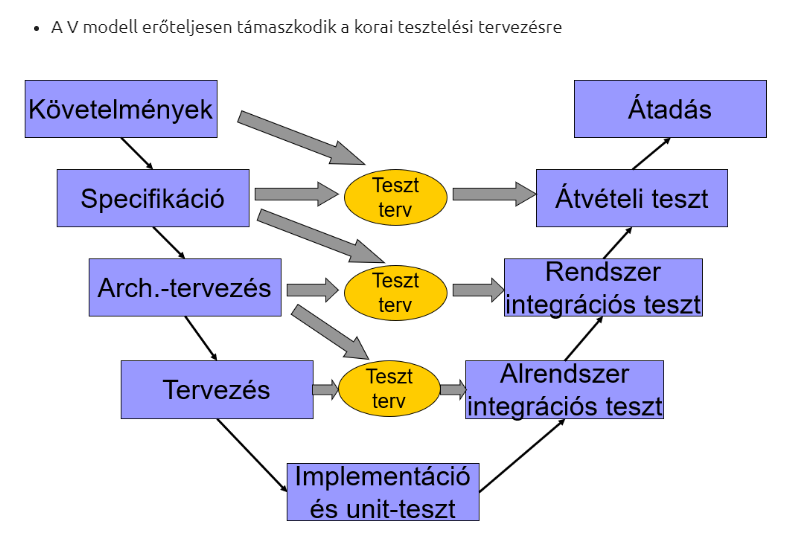

# Szoftverfejlesztési folyamat

Szoftverfejlesztési folyamatnak nevezzük egy bizonyos modell szerinti tevékenységek összességét, amelynek eredménye a szoftvertermék. Ez több komponens összeségéből áll össze:

- fejlesztési folyamat
- menedzsment
- technikai módszerek
- eszközök használata

Az elkészült terméknél fontos:

- funkcionális követelmények megléte
- teljesítmény
- üzembiztonság
- jól használhatóság, felhasználói élmény
- karbantarthatóság

Fejlesztés előtti, fontos feladatok:

- Kezdeti terv, vízió, amely az idő folyásával változhat
- Megszórítások összegzése (fejlesztői kapacitás, megrendelő határidő igényei)
- Paraméterek összegyűjtése
- Mérföldkövekké bontás, átadások tervezése
- Ütemterv létrehozása, a fejlesztési kapacitás elosztása a mérföldkövek alatt

A projekt ütemezése az egyik legnehezebb feladat, ez főleg a becslés miatt van, nehéz számolni a fejlesztői kapacitással (pl. szabadságok, váratlan betegségek, diákok a projekten)

A szoftverfejlesztés fő fázisai:

- specifikáció (szoftver funkcionális leírása, meghatározása)
- fejlesztés (a szoftver funkcióinak implementálása)
- validáció, verifikáció (szoftver helyességének ellenőrzése)
- evolúció (karbantartás, felügyelés)

# Szoftverfejlesztési folyamatok modelljei

## Vízesés modell

Ez esetében a szoftverfejlesztés fő fázisai egymás után következnek, szekvenciálisan. Ezt a modellt a legegyszerűbb kivitelezni, viszont szükséges hozzá már az elején az alapos munka, a specifikációnak minden előre látható esetet, hibát, problémát le kell fednie, és ez hatalmas rizikóval is jár: ha a specifikáció során követünk el olyan hibát, amely a fejlesztési folyamat későbbi részén jön elő (pl. verifikációkor), akkor a projektnek vissza kell térnie a specifikációs fázisra, és ezzel potenciálisan már elvégzett munka veszhet kárba. Emellett a megrendelő is elég későn fogja látni a kész terméket, és a gyakorlatban sokszor előfordul, hogy addigra megváltozik a piaci igény, ezzel együtt a megrendelő véleménye, ezen változtatni pedig drága lehet.

### V modell

A vízesés modell kiterjesztése, a V betű két szára a fejlesztési fázis és a tesztelési fázist mutatja be részletesebben, emellett az azok közti kapcsolatot is ábrázolja (az egy szinten lévő fejlesztési és tesztelési lépések összekapcsolnak, azok egymást tesztelik). A V modell szorgalmazza a korai tesztelés elkezdését.

## Iterációs vagy inkrementális modell

A leírt fázisokat kisebb specifikációkon alkalmazzuk, és folyamatosan ismételjük. Minden egyes új iterációnál van lehetőségünk a megrendelő véleményét kikérni, ezzel elősegítve azt, hogy a készülendő szoftver jó irányba halad fejlesztés szempontjából, azonban ezek az iterációk még mindig vízesés modellben működnek. Az inkremens megválasztása a legnehezebb feladat, ugyanis kicsi inkremens esetén az nem feltétlen lesz működőképes (ha ez probléma a megrendelőnek), nagy inkremensnél pedig érezhető lehet, hogy a vízesés modell problémája visszatér.

### Evolúciós (prototípus) modell:

Ez is inkremens alapú fejlesztés, de ilyenkor a fejlesztők egy gyors prototípust hoznak létre a megrendelő nem pontos, durva leírása alapján, majd minden inkremenssel folyamatosan finomítják ezt a prototípust, amíg az a megrendelőnek nem felel meg. Gyakori, hogy felesleges munka keletkezik, azonban ez általában minimálisabb, mint az a rizikó, amely a vízesés modellel jár.

### Komponens alapú modell

A szoftvert komponensekre bontjuk, melyek akár külön megvásárolhatóak, újrafelhasználhatóak, és akár izoláltan is működnek. A komponenseket a követelmény alapján kell meghatározni, és egy követelmény teljesítéséhez akár több komponenst is szükséges lefejleszteni, vagy akár annak megvásárlására is lehetőség lehet. Azonban nagy hátrány lehet, hogy a követelményeknél lehetséges kompromisszumokat kell kötni.

### RAD modell

A prototípus és az inkrementális modell az alapja. Az alkalmazáson több csapat dolgozik, párhuzamosan fejlesztik, amely miatt nehéz, vagy szinte lehetetlen lehet bizonyos projeket esetén a kivitelezése. Általában a 60-90 nap alatt történik meg a fejlesztés. A modell használata itt is igényli a megrendelőtől a rendszeres visszacsatolást, megerősítést.

### Spirális modell

A spirál modell rizikóvezérelt szoftverfejlesztési folyamat, és az egyedi rizikómintázatok alapján követeli meg a fejlesztőcsapattól, hogy alkalmazzanak különböző modelleket a fejlesztés különböző fázisai során.

## Agilis szoftverfejlesztés

Az agilis szoftverfejlesztés extrém iteratív modell. Többféle megvalósítása is létezik, pl. Scrum, Kanban, Extreme Programming. Fő eleme a fix idejű iterációk. Az agilis kiáltvány 4+1 fontos tételt vagy értéket határoz meg:

- Egyének és interakcióik, szemben az eljárásokkal és eszközökkel
- Működő szoftver, szemben a teljes körű dokumentációval
- Együttműködés a megrendelővel, szemben a szerződésről való alkudozással
- Változásokra való reagálás, szemben a terv követelésével
- Azaz, annak ellenére, hogy a jobb oldalon szereplő tételek is értékkel bírnak, mi többre tartjuk a bal oldalon feltüntetetteket.

### SCRUM

A Scrum az agilis módszertan legismertebb megvalósítása. A fejlesztési folyamatot 2-4 hetes ciklusokra bontja, könnyen elérhető, kicsi inkremensű gólok meghatározásával. Ezek az úgynevezett sprintek. A vízesés modellel ellentétben, a Scrum nem a határidőt tolja ki, hanem a scope-ból vesz vissza ha szükséges.

A Scrum sokszor nem is projektként tekint a szoftverfejlesztésre, amely fix céllal ér véget, hanem termék fejlesztéseként, amelynek élettartama a megrendelőtől függ.

A Scrum fő célja, hogy a megrendelőnek minnél hamarabb értéket szállítsanak a fejlesztők, hogy arról visszacsatolást és megerősítést tudjanak szerezni. A Scrum csapatokban mindenki fejlesztő, nincsenek, vagy ritkák a specializált pozíciók, ezzel elkerülve a kényes helyzetet, ha pl. a csapat egyetlen backendese szabadságon van, és nem tudnak ahhoz hozzányúlni. Azonban kettő fontos szerepkör van, amelyet be szoktak tölteni, az egyik a Product Owner, aki a termékért elsőszámban felel. Ő vezényli az ügyfelekkel az interakciót és ő mondja ki a végső szót funkcionális kérdésekben. A másik ilyen a Scrum Master, aki a Scrum folyamatokért felel, illetve azért, hogy a csapat összedolgozzon. Fontos ceremóniái a Daily standupok, amely célja, hogy kiderüljön, ha valaki elakadt, illetve ha a sprint goal veszélyben van, a refinement, ahol a még nem beütemezett feladatokat nézik át a csapat tagjai, és specifikálják, illetve a sprintforduló, ahol beütemezik a következő sprintre a feladatokat, meghatározzák a következő célt, és átnézik, hogy a folyamatokon lehetne-e javítani (retrospektíva).

### Kanban

A Kanban esetén a munkát appró feladatokra osztjuk, és azok állapotai alapján oszlopokba szervezzük őket, bal oldalt az az állapot ami a legmesszebb van a késztől, jobb oldalt pedig a kész állapot. Ez lesz a Kanban board. Általában egy ilyen board így néz ki:

| Backlog | In Progress | Review | Test   | Done    |
| ------- | ----------- | ------ | ------ | ------- |
| Task 1  | Task 2      | Task 3 | Task4  | Task 5  |
| Task 6  | Task 7      |        | Task8  | Task 9  |
| Task 10 |             |        | Task11 | Task 12 |
| Task 13 |             |        |        | Task 15 |
| Task 16 |             |        |        |         |
| Task 17 |             |        |        |         |

Az oszlopokhoz általában limitet is szoktak rakni. Ha az oszlop betelik, a Kanban esetén akkor szoktak retrospektívát tartani. Fontos, hogy a boardon az elemek prioritási sorrendben vannak, a legmagasabb elemnek kell lennie annak, amelyet a leggyorsabban kell lefejleszteni.

A Kanban board-ot általában a Scrum mellé is szokták használni, hogy jobban vizualizálják a Sprint állapotát.

### Extreme programming

Agilis és szélsőséges iteratív módszer. Kis idejű ciklusokra bontja a fejlesztést, amely egy fix funkció lefejlesztését követeli meg. Itt is nagy az igény a megrendelő megerősítésére, és visszacsatolására, ezért a program . Gyakori a modellben a pair programming, amely esetén akár több fejlesztő is fejleszt egyszerre egy képernyő előtt.
