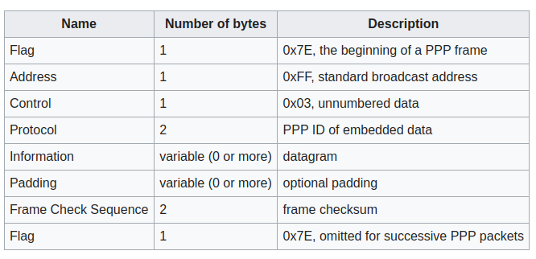
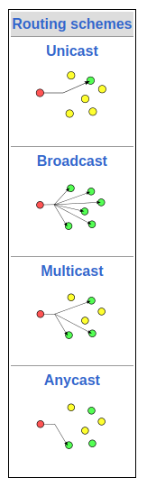

# Point to Point Protocol (PPP)

Az OSI modell adatkapcsolati (2.) rétegen használatos, kommunikációs protokoll, célja két router közvetlen összekapcsolása, bármilyen fizikai (1.) réteg felett használhatjuk. Támogatja a hibajelzést, fejléctömörítést és akár a megbízható átvitelt is.

Olyan keretformátumot használ, amely tudja a keret végét és a következő keret elejét, illetve a hibajelzést is. A vonalak felélesztésére, tesztelésére és bontására LCP (Link Control Protocol)-t használ. Minden támogatott hálózati (3.) réteghez különböző NCP (Network Control Protocol) protokollt tartalmaz.

Kialakításkor a HDLC keretformátumot vették inspirációul, azonban a PPP karakteralapú. Egy PPP keret így néz ki:

Tömörítéskor, ha a kommunikációban résztvevő felek megegyeznek ebben, az Address és a Control mezők eldobhatóak.

A PPP alapesetben nem biztosít megbízható átvitelt, de zajos környezetben használhatunk számozást (sorszámok és nyugták).

Az adat mező maximum 1500 byte lehet.

# Ethernet

Ethernet a számítógépes hálózati technológiák családja, az IEEE 802.3-as szabvány.
Az Ethernet az OSI réteg fizikai (1.) és adatkapcsolati (2.) rétegben vállal szerepet, vezetékes kapcsolatért. Az Ethernet annyira elterjedt lett, hogy ma már a legtöbb alaplap hálózati kártya nélkül is támogatja, átlag háztartásokban is ezt használják a LAN kialakításához.

- LAN: helyi hálózat, közepes vagy nagysebességű összeköttetés, alacsony késleltetés, általában kisméretű terület (szoba, szint, épület), peer to peer kommunikáció (azaz egyenrangú), ma full duplex

- MAN: Metropolitan Area Network, egy nagyobb területű hálózatot jelent (pl. egyetem, kormányzati)

- WAN: Wide Area Network, széleskörű hálózat

# IP protokoll:

A hálózati rétegben (3.) használt protokol, feladata, hogy eljutassa a különböző csomagokat a hálózatban résztvevő szereplők közt. A protokol a fejlécben található cím alapján juttatja el a forrástól a címzettig a csomagot, amely miatt meghatározott formában kell az IP csomagokat feladni, és többféle címzési metódust is definiál:

Az IP alapvetően kapcsolatnélküli protokol, ezt a TCP egészítette ki, azaz a Transmission Control Protocol, amely már felelt azért is, hogy az elküldött csomagok megbízhatóan érkezzenek meg a másik félnek.

Az IP protokoll fontos eleme az IP cím, mely a különböző hálózati eszközök beazonosításáért felel. Kezdetben az IPv4 terjedt el, amely 4 bájtot használt ilyen címekhez, viszont ez kevés címnek bizonyult, így ma már létrejött az IPv6, amely 128 bites címeket használ, ezek 8 csoportból állnak, egy csoport 4 hexadecimális számjegyből.

Speciális címek:

hálózat legnagyobb címe (pl. 255.255.255.255) a hálózat broadcast címe
0.0.0.0 indulási cím
127.x.y.z ezen a címek soha nem hagyják el a gépek, pl. 127.0.0.1 localhost cím

# TCP

A TCP feladata, hogy a küldő számítógépén a küldendő adathalmazt csomagokra feldarabolaj, megszámozza, és a fogadó gépén azt újra összerakja az eredeti adathalmazzá. Mindezt megbízhatóan teszi, azaz a küldött csomagban biztosak lehetünk, hogy pontosan megérkezik, ha elveszne, akkor azt újraküldi. TCP kapcsolat orientált, ezt a three-way handshake-kel garantálja. Az adatot csomagokba darabolja, minden csomgahoz a fogadó egy ACK csomagot fog visszaküldeni, ezzel biztosítva, hogy ténylegesen minden csomag megérkezett.

A TCP a szállítási réteg (4.) egy protokollja.

Three-Way-Handshake:
Elmegy egy SYN (szinkronizációs) csomag a feladótól ezzel megkezdve a kérvényt a kapcsolat kiépítésére. A fogadó visszaküld egy SYNACK csomagot, amely a szinkronizációs csomagot nyugtázza, és egy saját szinkronizációs csomagot is küld. Ezt az eredeti feladó nyugtázza egy ACK-kal.

A kapcsolat lezárása 4 lépéses folyamat: a küldő fél küld egy FIN csomagot, ezt a fogadó fél nyugtázza, majd saját maga is küld egy FIN csomagot, amelyet a küldő fél is visszanyugtázz.

A TCP sokkal lassabb és nagyobb adatforgalmat termel, mint az UDP, a biztonsági mechanizmusai miatt, ezért valósidejű kommunikációhoz nem a legjobb.

# HTTP

Hyper Text Transmission Protocol egy alkalmazás rétegbeli (7.) protokol, amely különböző hipermédia-dokumentum küldésére lehet felhasználni. Maga a HTTP a TCP-re épül.

A HTTP egy klasszikus kliens-szerver modellt használ, ahol a kliens küld egy kérést a szervernek, az pedig kiszolgálja egy válasszal. A kapcsolat csak addig tart, amíg a kérés kiszolgálása, utána felbomlik és minden kéréssel újra fel kell építeni. HTTP egy állapotnélküli protokoll, a szerver kérések közt nem tárol el semmilyen session információt alapvetően, bár ez ma már a sütikkel megoldható.

Egy HTTP kérés a következő képpen épül fel:

- tartalmaz egy metódust, pl. GET, POST, PUT, PATCH, DELETE, OPTIONS
- egy URL-t, amely a hivatkozott erőforrásra mutat
- fejléceket, pl. milyen címre menjen a kérés a Host alatt, vagy a feladott törzs mime-formátuma (Content-Type) (application/json, text/html)
- a kérés törzse

Az erre érkező válasz a következőket tartalmazza:

- egy válasz státuszkódot és -üzenetet
- fejléceket
- a válasz törzsét

## HTTP válaszok

1xx: információt tartalmazó státuszkód, a kérés még nem került kiszolgálásra
2xx: sikeres volt HTTP kérés kiszolgálása

- 200 OK
- 201 Created
  3xx: további akciók szükségesek a kérés kiszolgálására (pl. átirányítás)
- 301 Moved Permanently
  4xx: kliens oldali hiba a kéréssel kapcsolatban, nem lehet kiszolgálni
- 400 Bad Request
- 401 Unauthorized
- 403 Forbidden
- 404 Not Found
- 418 I'm a teapot
  5xx: szerveroldali hiba a kéréssel kapcsolatban, nem sikerült kiszolgálni
- 500 Internal Server Error

# RSA

Rivest-Shamir-Adleman titkosítás egy asszimetrikus titkosítás, ahol különböző kulcsot használunk az üzenet titkosításához és feloldásához.

Működése:

Válasszunk kettő prím számot (ezek a gyakorlatban hatalmasak),

- pl. p = 2, q = 7.
- Kell p és q szorzata, ez lesz N (14).
- Ezután számoljuk ki az Euler féle phi(N)-et, amelyet, mivel N p és q prímszámok szorzata, kiszámolhatjuk a phi(N) = (p-1)(q-1) képlettel. Ez 6 \* 1 = 6
- Keressünk egy olyan e számot (encryption), amely 1 és phi(N) között található, és amelyre teljesül, hogy lnko(e, phi(N)) = 1 és lnko(e, N) = 1. Jelen esetben válasszuk 5-öt. Ez lesz a nyilvános kulcs, amelyet titkosításhoz használunk.
- Keresünk egy olyan d számot (decryption), amelynél d \* e mod phi(N) = 1.
  - Itt 5d mod 6 = 1, itt válasszuk 11-t

Ez esetben, ha numerikussá alakítjuk az üzenetünket, amelyet m szám jelez, a 2-es üzenetet titkosítjuk a következő képpen:

m^e mod N, amely jelen esetben 2^5 mod 14 = 4

Feloldani pedig a m^d mod N képlettel tudjuk, amely 4 ^ 11 mod 14 = 2.

Mivel hatalmas számokat használnak a kulcsok előállításához, és azokat nehéz visszafejteni, ezért jelenlegi ismereteink szerint nem létezik olyan algoritmus, amellyel megérné megpróbálni visszafejteni a titkosítást.
