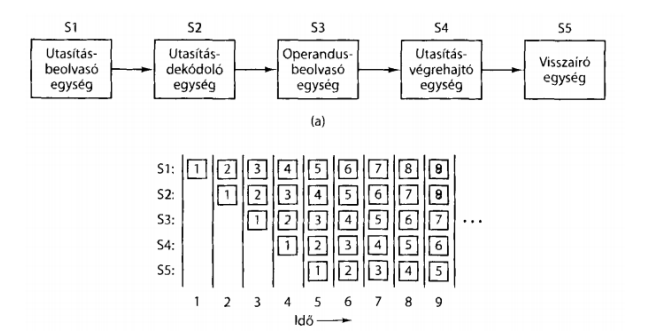
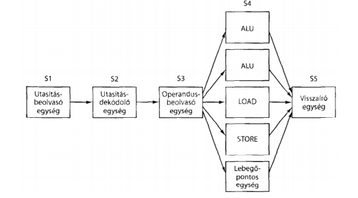

# Neumann-elvű gép egységei

Neumann-architektúra mára a tárolt programú számítógép fogalmává vált. A működést egy tárolt program vezérli, amit a vezérlési folyam / control flow segítségével lehet leírni.
Az aritmetikai és logikai műveletek (programutasítások) végrehajtását önálló részegység végzi (ez az ALU). A számokat kettes számrendszerben ábrázolják, és 5+1 funkcionális egysségből áll:

1. központi memória: a program kódját és adatait tárolja valamilyen kódolt, számbeli formátumban
2. központi feldolgozó egység (CPU), a központi memóriában tárolt program utasításait beolvassa és végrehajtja
3. külső sín: részegységeket köti össze, adatokat, címeket, vezérlőjeleket továbbít
4. belső sín: CPU részegységei közötti kommunikációt hozza létre (vezérlőegység / ALU regiszterek között)
5. beviteli és kiviteli eszközök: kapcsolatot teremt a felhasználóval, adatot tárol a háttértáron
6. +: működést biztosító eszközök (tápegység, gépház)

A vezérlőegységet (CU) utasításokat olvas be, és vezérli az ALU regiszterek működését.

Az ALU végzi a tipikus aritmetikai műveleteket (összeadás, kivonás, stb..), és ezeket az output regiszterre írja.

A regiszterek kis méretű, gyorsan címezhető és olvasható memóriarekeszek, amelyek részeredményeket és vezérlőinformációkat tárolnak, a számítógépekben a CPU és a mikroprocesszorok gyorsan írható-olvasható tárolóegységei, ideiglenes tartalmú, és általában egyszerre csak 1 gépi szó tárolására alkalmasak.

Az adatút az adatok áramlásának útja, alapfeladata, hogy kiválasszon egy vagy két regisztert, amelyet majd az ALU-val felhasználtat egy művelet elvégzésére, az eredményt pedig beleíratja egy kimenet regiszterbe.
Van, ahol mikroprocesszor a felelős érte, van ahol külön hardver.
Folyamata:

- a regiszter készletből feltöltjük az ALU kettő regiszterét (legyen A és B)
- az eredmény az ALU kimenő regiszterébe kerül
- az ALU kimenő regiszteréből a kijelölt regiszterbe kerül az eredmény

Adatútciklus: amikor a két operandus az ALU-n keresztül megy, és létrejön az eredményregiszterben az érték

Utasítás-végrehajtás: a mikroprocesszor 1-1 utasítása úgynevezett gépi ciklusok sorozatából áll, vagyis 1 utasítás egy vagy több gépi ciklusból tevődik össze, amit a CPU appró lépések sorozataként hajt végre:

- a soron következő utasítás beolvasása a memóriából az utasításregiszterbe
- az utasításszámláló beállítása a következő utasítás címére
- a beolvasott utasítás típusának meghatározására
- ha az utasítás memóriabeli szót használ, a szó helyének megállapítása
- ha szükséges, a szó beolvasása a CPU egy regiszterébe
- utasítás végrehajtása
- vissza az első pontra

Ez a lépéssorozat a betöltő-dekódoló-végrehajtó ciklus, központi szerepet tölt be minden számítógép működésében.
Probléma: a memória elérése lassú. Ez miatt ha ezeket a műveleteket szekvenciálisan bonyolítjuk le, akkor a memória miatt sokszor kihasználatlan a CPU és csak várakozással megy el az idő. Lehet az órajelet gyorsítani, de ennek vannak határai, nem feltétlen jó megoldás. Ezért sok esetben ennek a folyamatnak a párhuzamosítását próbálják elérni.

Késleltetés: utasítás végrehajtásának ideje
Áteresztőképesség: MIPS, hány millió utasítást tudunk végrehajtani egy másodperc alatt

Utasításszintű párhuzamosság: hogy gyorsítsunk a folyamatokon, az utasításokat előre beolvashatjuk, és így rendelkezésre állnak amikor szükség van rájuk. Ezeket egy puffer (prefetch buffer) tárolja. Így a soron következő utasítást már nem a memóriából olvassuk be.

Csővezeték: az utasítás szintű párhuzamosságot fejleszti tovább. Az utasítás végrehajtásának lépéseiért több hardver felel, és mindegyik valamely utasításon dolgozik. Ezzel javítunk az utasítások végrehajtásának sebességén, kisebb lesz a késleltetés, és jobb lesz az áteresztőképesség.

Párhuzamos csővezeték: kettő, vagy több csővezetékünk van, amelyek végrehajtják az utasításokat. Ezeknek saját ALU-juk van. Azonban ezesetben fontos, hogy az utasítások közt semmilyen függőség ne legyen, ennek betartását pedig a fordítóprogramnak kell felelnie, vagy pedig egy külön hardvernek, amely odafigyel ilyen potenciális konfliktusokra.

Szuperskaláris architektúra: itt egy csővezetéket használunk, azonban annak több funkcionális egysége is van. Ezek a processzorok képesek 4-6 utasítás működésének megkezdésére egyetlen órajel alatt. Egy ilyen szuperskaláris CPU-nak több funkcionális egysége van. Az utasításokat nagyobb ütemben kezdi el elvégezni, mint ami alatt végre lehetne azokat hajtani.

