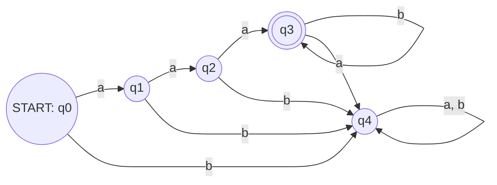
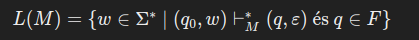
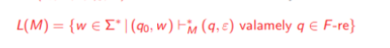

# Környezetfüggetlen nyelvek és reguláris nyelvek definíciói

## Formális nyelv:

a matematika, logika és informatika számára egy véges ábécéből generálható, véges hosszúságú szavak (pl. karakter stringek, jelsorozatok) halmaza

## ABC:

Szimbólumok véges nem üres halmaza, jele szigma, pl szigma = {a, b, c}

## Szó:

Az adott szigma ABC betűiből álló véges sorozat.

## Epszilon:

Üres szó, hossza 0

## Szigma \*

Az összes szó halmaza, amely szigma ABC-ből generálható

## Szigma +

Szigma \* / { epszilon }

## Nyelv:

A szigma \* tetszőleges részhalmazát szigma feletti nyelvnek nevezzük, jele L. Ha L véges számú szóból áll, akkor az egy véges nyelv.

```
Szigma = {a, b} ábécé
akkor L1 = {a, b, ab} egy véges nyelv
L2 = {a^ib^i | i eleme Z+} végtelen nyelv
```

## Nyelvtan:

Olyan végesen specifikált eszköz, amellyel nyelvek meadására van lehetőség. A nyelv az szavak halmaza, a nyelvtan egy eszköz, amellyel nyelvet lehet generálni.

## Környezetfüggetlen nyelvtan és nyelv:

```
G = (N, Szigma, P, S)

N a nemterminálisok ábécéje
Szigma a terminális (befejező, végső) ábécé, nincs közös eleme az N halmazzal
S a kezdő szimbólum
P pedig A->alpha alakú átírási szabályok véges halmaza, úgy hogy A eleme N
és alpha eleme (N u Szigma)*

N azok a betűk halmaza, amelyek nemterminálnak
Szigma azok a betűk halmaza, amik terminálnak
S a kezdő szimbólum
P pedig olyan szabályrendszer, amely nemtermináló karakterből egy olyan nyelvbe megy, amely a nemtermináló és termináló karakterek uniójából képződik

P minden szabályára igaznak kell lennie ennek a feltételnek.
```

Ha egy L nyelvhez, megtudunk adni egy környezetfüggetlen nyelvtant, akkor az L nyelvünk környezetfüggetlen.

## Reguláris nyelvtan és nyelv:

Akkor nevezünk egy G=(N, szigma, P, S) nyelvtant regulárisnak (jobblineárisnak), ha P-ben minden szabály A->xB, vagy A->x alakú, tehát minden szabálynak olyan alakot kell képeznie, amely esetén nemterminálisból legfeljebb egy darab lesz. Ez érvényes minden szóra is, amelyet az S kezdőszimbólumból vezetünk le. Ezeket a levezetéseket az A->x alakú szabállyal fejezzük be.

A reguláris nyelv olyan L nyelv, amelyet ilyen reguláris nyelvtan generál. A reguláris nyelvek halmazát REG-gel jelöljük. Minden reguláris nyelvtan környezetfüggetlen, és minden reguláris nyelv is környezetfüggetlen.

# Véges automaták és reguláris kifejezések

A determinisztikus automaták, olyan véges automaták, ahol egy bizonyos betű előfordulására az automata állapota biztosan meghatározható állapotba kerül át (minden állapotból az ABC minden betűjére meg van határozva milyen állapotba megy át).

```
Jelölése
M = (Q, szigma, delta, q0, F)
Q: az állapotok nem üres, véges halmaza
Szigma: input ábécé
Delta: egy Q x szigma->Q leképezés (átmenetfüggvény)
q0: kezdő állapot
F: végállapotok halmaza (Q részhalmaza)
```

Az automatát táblázatos formában is megadhatjuk, ilyenkor a táblázat első sora a kezdő állapot, a végállapotokat pedig megjelöljük. Illetve lerajzolhatjuk irányított gráfként is, ilyenkor egy csúcs egy állapot, a gráfok éleire ráírjuk, hogy mely betű hatására mozgunk a mutatott állapotra, és a végállapotokat szintúgy (dupla karikával) megjelöljük. Ilyenkor a kezdő állapot mellé egy fektetet háromszöget rakunk.

Az automata elkezdi sorban olvasni a szöveg karaktereit, és a meghatározott átmenetek szerint váltani az aktuális állapotok között. Ha elfogy a szöveg, megnézzük, hogy végállapotban vagyunk-e, ha igen, akkor az automata felismerte a szót.

Pl. automata, amely felismeri az "aaab\*" nyelvet.



| delta | a   | b   |
| ----- | --- | --- |
| q0    | q1  | q4  |
| q1    | q2  | q4  |
| q2    | q3  | q4  |
| q3    | q4  | q3  |
| \*q4  | q4  | q4  |



Az M automata által felismert nyelven az L(M) = { w eleme szigma\* | létezik olyan n, amely esetén (q0, w)-ból (q(n), epszilon) állapottá alakul M által és ezen q(n) eleme F }

A nemdeterminisztikus automatáknál egy betű hatására több állapotba is átkerülhetünk, ilyenkor párhuzamosan vezetjük tovább a lehetséges utakat. Ha valamelyik úton végállapotba kötünk ki, akkor az automatánk felismerte a szót.



Az előző definíció itt annyiban változik, hogy több végállapot melett is terminálhat az automatánk. Ilyenkor elég, ha legalább csak az egyik végállapoton állt meg ahhoz, hogy az automata felismerje a nyelvet.

A nemdeterminisztikus automata akkor teljesen definiált vagy teljes, ha minden állapot (q eleme Q) és betű (a eleme szigma) esetén az átmeneti függvény által generált állapothalmaz legalább egyelemű. (Tehát minden állapotból minden betűhöz tartozik legalább egy átmenet valamely állapotba).

**TÉTEL**: Tetszőleges M nemdeterminisztikus automatához megadható egy olyan M teljesen definiált automata, amely ugyanazt a nyelvet ismeri fel (tehát a nemteljes nemdeterminisztikus automata is teljesre hozható). Ezekhez úgynevezett csapdaállapotokat kell felvenni.

**TÉTEL**: Egy nyelv akkor és csak akkor ismerhető fel nemdeterminisztikus automatával, ha az felismerhető determinisztikussal is. (Minden létező nemdeterm. automatához létezik legalább egy determinisztikus is.)

A nemdeterminisztikus epszilon automaták olyan véges automaták, ahol egy adott input szimbólum hatására akár több állapotba is átkerülhetünk, és olyan átmenet is megengedett, amelyik "nem fogyasztja az inputot." Ezt is az M = (Q, szigma, delta, q0, F) elemekkel jelöljük. A felismert nyelv definíciója megegyezik a nemdeterminisztikuséval.

**TÉTEL**: Egy nyelv akkor és csak akkor ismerhető fel nemdeterminisztikus epszilon automatával, ha az felismerhető nemdeterminisztikus automatával is. Tehát minden epszilon nemdet automatához létezik legalább egy ekvivalens nemdet automata.

## Reguláris kifejezések

A reguláris kifejezések egy szigma ABC felett a:

∅ = {}

ε = ""

(Σ ∪ { ∅, ε, (,), +, \* })\* halmaz legszűkebb olyan U részhalmaza, amelyre az alábbi feltételek teljesülnek:

- ∅ eleme U

- ε eleme U

- Bármely u eleme Szigma-ra, hogy az u szimbólum eleme U-nak
- Ha R1, R2 eleme U-nak, akkor (R1+R2), R1R2, R1\* és R2\* is eleme U-nak

R kifejezés által meghatározott nyelv az |R|.

- Ha R = ∅, akkor |R| = ∅ (üres nyelv), tehát semmilyen szót nem ismer fel.

- Ha R = ε, akkor |R| = {ε} (tehát csak az üres szót ismeri fel)

- Ha R = a, akkor |R| = {a} (csak az a szót ismeri fel)

- Ha R = R1 + R2, akkor |R| = |R1| unió |R2|

- Ha R = (R1)(R2), akkor |R| = |R1||R2|

- Ha R = (R1)\*, akkor |R| = |R1|\*

L szigma feletti nyelv akkor fejezhető ki reguláris kifejezéssel, ha létezik olyan szigma feletti R reguláris kifejezés, amelyre igaz, hogy |R| = L.

## Ekvivalencia tétel

[Előadás dia](https://www.inf.u-szeged.hu/~fulop/oktatas/regp4_diak.pdf)

TÉTEL!!!

Ha van egy szigma feletti L nyelvünk, akkor a következő három állítás ekvivalens:

1. L reguláris nyelv, generálható 3 típusú nyelvtannal
2. L felismerhető automatával
3. L reprezentálható reguláris kifejezéssel

### Bizonyítás:

- Lemma: (3) => (1)
- Lemma: (1) => (2)
- Lemma: (2) => (3)

(1) <==> (2) <==> (3)

#### 1. lemma

Ha az L nyelvhez létezik reguláris kifejezés, akkor generálható három típusú nyelvtannal.

Bizonyítás: Az L-et reprezentáló R reguláris kifejezés szerinti indukcióval. Azaz megadunk olyan nyelvtant, ami
kigenerálja a kifejezéshez tartozó nyelvet.

Indukció alapja

- R=∅, akkor G=({S}, Szigma, ∅, S)
- R=a, ahol a eleme szigma vagy a = epszilon, akkor G=({S}, Szigma, {S->a}, S)

Unió:

Indukciós lépés

```
R = R1 + R2
ekkor
L = |R| = L1 unió L2, ahol L1 = |R1| és L2 = |R2|
```

Indukciós feltevés:

```
Li generálható Gi = (Ni, szigma, Pi, Si) 3 típusú nyelvtannal,
ahol i eleme { 1, 2 } és
N1 metszet N2 = ∅
```

Akkor L generálható
G = (N1 unió N2 unió { S }, szigma, P1 unió P2 unió { S-> S1, S-> S2 }, S)

Konkatenáció:

Indukciós lépés

```
R = (R1)(R2)
Ekkor L = |R| = L1L2 ahol L1 = |R1| és L2 = |R2|
```

Indukciós feltevés

```
Li generálható Gi = (Ni, szigma, Pi, Si) 3 típusú nyelvtannal,
i = 1, 2,
N1 metszet N2 = ∅

Akkor L generálható G = (N1 unió N2, szigma, P, S1) 3 típusú nyelvtannal,

ahol P a legszűkebb olyan szabályhalmaz amire teljesülnek a következő feltételek:

Ha A->xB eleme P1, akkor A->xB eleme P
Ha A->x eleme P1, akkor A->xS2 eleme P

P2 minden eleme P-nek is.

S1 =>*G1 w1 és S2 =>*G2 w2 akkor és csak akkor, ha

S1 =>*G w1 és S2 =>*G w1w2
```

Hatvány

```
Indukciós lépés
R=(R1)*

Ekkor L = |R| = L1*, ahol L1 = |R1|

Indukciós feltevés

L1 generálható G1 = (N1, szigma, P1, S1) 3 típusú nyelvtannal

Akkor L generálható G = (N1 unió { S }, szigma, P, S) 3 típusú nyelvtannal,
ahol S egy új szimbólum, P pedig a legszűkebb olyan szabályhalmaz, amire teljesülnek a következő feltételek

S->S1, S-> epszilon eleme P
Ha A->xB eleme P1, akkor A->xB eleme P
Ha A->x eleme P1, akkor A->xS eleme P

S =>G epszilon

S =>G S1=>G* w1S =>G w1 (eleme L1)
S =>G S1=>G* w1S S1=>G* w1w2S =>G w1w2 (eleme L1, L2)
```

#### 2. lemma

Ha L szigma feletti nyelv reguláris, akkor felismerhető automatával

Bizonyítás:

```
Legyen L egy reguláris nyelv, és tegyük fel, hogy L = L(G), ahol G egy 3 típusú nyelvtan

Minden G = (N, szigma, P, S) 3 típusú nyelvtanhoz megadható vele ekvivalens

G' = (N', szigma, P', S) 3 típusú nyelvtan, úgy hogy P'-ben minden szabály

A -> B
A -> aB
vagy
A -> epszilon,

ahol A, B eleme N és

a eleme szigma

Minden ilyen szabállyal rendelkező 3 típusú nyelvtanra igaz az, hogy megadható hozzájuk véges nem determinisztikus epszilon automata.

```

# Pumpáló lemmák

Minden L reguláris nyelv felírható a pumpáló lemma által leírt szabályokkal

- létezik k pozitív egész szám
- bármely w eleme L-re, ahol |w| >= k, akkor van olyan w = w1w2w3 felbontás, ahol

- 0 < |w2|, és |w1w2| <= k
- minden n >= 0-ra, (w1)(w2^n)(w3) eleme L

Ha ezek a feltételek nem teljesülnek, a nyelv nem reguláris

# Zártsági tulajdonságok műveletekre

Műveletekre való zártság általában:

```
Legyen C nyelvek egy osztálya (környezetfüggetlen vagy reguláris)

és

P(Szigma*) x P(Szigma*) -> P(Szigma*), (L1, L2) -> L1 • L2

egy kétváltozós művelet nyelvekkel.

Azt mondjuk, hogy C zárt • műveletre, ha bármely L1, L2 eleme C esetén, L1 • L2 eleme C.

Az egyváltozós műveleteknél

P(Szigma *) -> P(Szigma *), (L1) -> L1•

C zárt • műveletre, ha bármely L1 eleme C esetén, L1• eleme C.
```

## Reguláris nyelvek zártsági tulajdonságai

### Reguláris műveletek: U, konkatenáció, \*.

Tétel: A reguláris nyelvek osztálya zárt a reguláris műveletekre.

### Boole műveletek: unió, metszet, komplementer.

Tétel: A reguláris nyelvek osztálya zárt a Boole műveletekre.

Komplementer bizonyítása: ábrázoljuk a nyelvet egy véges automataként. Cseréljük meg a vég és nemvégállapotok halmazát. Mivel ez nem befolyásolja az automata végességét, így még mindig reguláris nyelvről beszélünk.
