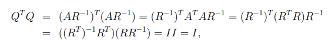
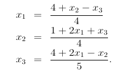
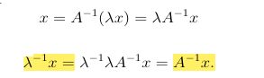

# Általános fogalmak

Egy A mátrix diagonális, ha a főátlón kívül az elemek 0-k.

Egy I mátrix egységmátrix, ha a főátlóban egyesek, a többi helyen 0-k szerepelnek

Egy A mátrix transzponáltja az az A^T mátrix, ahol A sorai az A^T oszlopai, és A oszlopai A^T sorai.

- Tehát A(i, j) = A^T(j, i) elemével.

Egy A mátrix szimmetrikus, ha A = A^T, azaz megegyezik a transzponáltjával

Egy A mátrix pozitív definit, ha szimmetrikus, és minden nem 0 vektora x^TAx > 0.

Egy A mátrix minden i-edik főminorja az A első i sorából és i oszlopából képzett A mátrix determinánsa

Egy A mátrix háromszög mátrix, ha a főátló alatti vagy feletti helyeken vannak csak 0 értékek. Ha a főátló alatt vannak csak 0-k, akkor az felső háromszög, ha felette, akkor alsó háromszög.

Egy A mátrix szinguláris, degenerált, ha a determinánsa 0, azaz nem invertálható.

Egy A mátrix invertálható, vagy reguláris, ha létezik olyan B mátrix, amellyel megszorozva egységmátrixot kapunk.

Egy Q mátrix ortogonális, ha a mátrix inverze megegyezik a transzponáltjával, tehát QQ^T = I.

Egy A mátrix diagonálisan domináns, ha minden főátlóbeli elemének abszolút értéke nagyobb vagy egyenlő az őt tartalmazó sor összes többi elemének abszolútértékétől. Szigorúan diagonálisan domináns lesz, ha az egyenlőséget nem engedjük meg.

# Lineáris egyenletrendszerek

Lineáris egyenletrendszerek a következő alakban szoktak szerepelni.

Ax = b, ahol A mátrix az együtthatókat tartalmazza, b vektor az

```
A(1, 1) * x1 + A(1, 2) * x2 + ... + A(1, n) * xn = b1
A(2, 1) * x1 + A(2, 2) * x2 + ... + A(2, n) * xn = b2
...
A(n, 1) * x1 + A(n, 2) * x2 + ... + A(n, n) * xn = bn
```

Ha az A mátrix háromszög mátrix lenne, akkor az egyenletrendszer megoldása triviális lenne.

Pl. egy három változós egyenletrendszer esetén így nézne ki.

```
A(1, 1) * x1 + A(1, 2) * x2 + A(1, 3) * x3 = b1
      0 * x1 + A(2, 2) * x2 + A(2, 3) * x3 = b2
      0 * x1 +       0 * x2 + A(3, 3) * x3 = b3
```

Kettő módszerosztály van a lineáris egyenletrendszerek megoldására:

- direkt módszer: véges sok lépés után megmondják a megoldást (kis és közepes, illetve sávmátrixokra)
- iterációs módszer: minden iterációval egyre jobb és jobb közelítést adnak a megoldáshoz, de azt véges sok lépésben nem érik el (általánosabb használatra)

# Eliminációs módszerek, mátrixok trianguláris felbontásai

Eliminációs módszerek: Gauss eliminációval háromszög mátrixá alakítjuk a kiindulási A mátrixunkat, korábban pedig már megállapítottuk, hogy az ilyen egyenletrendszer megoldása triviális.

Gauss elimináció során az A mátrixok úgy transzformáljuk, hogy a létrehozott egyenletrendszer ekvivalens legyen az előzővel. Két egyenletrendszer akkor ekvivalens, ha a megoldásaik halmaza megegyezik. A következő transzformációkkal tudjuk ezt betartani:

- sor egy nemnulla számmal beszorzása
- egy sor c-szereséenk hozzáadása egy másik egyenlethez

Az átalakításokkal tehát vagy háromszög, vagy diagonális mátrixot hozunk létre.

## Eliminációs mátrixok

M(k) egy olyan ????????????

## LU

MAx = M(n-1) ... M(1)Ax = M(n-1)M1b = Mb

M = M(n-1)M(n-2)...M2M1

M(1) az A mátrix 1. főátlóbeli elemére támaszkodik,
M(k) az M(k-1)A mátrix k. főátlóbeli elemére támaszkodik.

Ez a felbontás az A mátrixot LU alakra hozza, ahol

A = LU,

ahol L és U háromszögmátrixok

L = M^-1 = (M(n-1)...M1)^-1 = M1^-1 ... M(n-1)^-1 = L1 ... L(n-1)

Ebből következik:

U = MA egy felső háromszög mátrix, L diagonális elemei pedig egyesek

Ez miatt a feladatunk megoldása egyszerűbb, helyettesítsünk be az

Ax = b

helyett

LUx=b

legyen y = Ux

Ly=b

ezután

Ux = y

így

y = Mb lesz

Tehát a következő lépésekkel oldjuk meg a lineáris egyenletrendszert:

1. A mátrixot felbontjuk LU szorzatra
2. `Ly = b`-t megoldjuk y-ra
3. `Ux = y`-t megoldjuk x-re

## Cholesky

- Ha A mátrix szimmetrikus és pozitív definit

Akkor az LU felbontás esetén U = L^T, szóval

A = LL^T

és L alsó háromszög mátrix diagonális elemei pozitívak.

Cholesky felbontás jóval gyorsabb, mint az általános LU mátrix.

legyen `chol(A)` függvény az, amely megadja A mátrix Cholesky felbontását

illetve `R\y = x` adja meg `Rx = y` egyenlet megoldását,

akkor az algoritmusunk a Cholesky felbontással az Ax = y lineáris egyenletrendszer megoldására

```
R = chol(A)
y = R^T \ b
x  = R \ y
```

QR felbontás

A mátrixot bontsuk fel QR szorzatra, ahol Q egy ortogonális mátrix, és R egy felső háromszögmátrix.

### TÉTEL:

Tetszőleges A négyzetes valós reguláris mátrixnak mindig létezik QR felbontása.

### BIZ:

Mivel A reguláris, ezért `(A^T)A` mátrix pozitív definit,

tehát létezik `(R^T)R` Cholesky felbontása.

Ekkor `Q = A(R^-1)`.

Mutassuk meg, hogy QR az A mátrix ortogonális, trianguláris mátrixa. R a Cholesky felbontás miatt felső háromszög mátrix.

Bizonyítsuk be, hogy Q ortogonális, azaz

`(XY)^T = (Y^T)(X^T)`

`(Q^T)Q = I`



### Ekkor az Ax = b egyenletrendszer megoldása

qr(A) legyen az a függvény amely tuple-ként visszaadja a QR felbontását A mátrixnak

```
(Q, R) = qr(A)

x = R \ (Q^T * b)
```

# Lineáris egyenletrendszerek megoldása iterációs módszerekkel

## Jacobi iteráció

Az egyenletrendszerünk továbbra is Ax = b alakban van.

Az egyenletrendszer i-edik sorát alakítsuk át x(i)-vel való egyenlőségre.

Tehát pl.

```
 4x(1) -  x(2) +  x(3) =  4
 2x(1) - 4x(2) +  x(3) = -1
-2x(1) +  x(2) + 5x(3) =  4
```

átalakítjuk



(baloldalt x k+1-edik iterációját használjuk, jobb oldalt x k-ik iterációját)

Vegyünk egy induló vektort (pl. x(0) = (1, 2, 3)^T), és helyettesítsünk be

a megkapott eredmény lesz az x értéke az első iterációban, ezt ismételve az eredménynek el kell kezdenie konvergálni x megoldáshoz.

Azonban nem mindig konvergál.

Legyen D az A mátrix diagonális elemeiből álló mátrix (a többi elem pedig 0).

Ahhoz, hogy konvergáljon a Jacobi iteráció, szükséges, hogy

|| (D^-1)(A - D) || < 1

## Gauss-Seidell iteráció

Annyiban változik a Jacobi iterációtól, hogy amint egy új értékünk van x(i)-re, már azzal számolunk tovább, nem várjuk meg vele a következő iterációt

Gyorsabb lesz, mint a Jacobi iteráció

## Végrehajtás

Az iterációs módszereket véges mennyiségben végre lehet hajtani, vagy mondhatjuk azt, hogy egy bizonyos delta érzékenységhez kötjük. Ha a két iteráció közti eredmény különbsége nem üti meg ezt a delta értéket, akkor terminálunk. Érdemes mindkét feltételt összekötni, mert delta megadása esetén ha nem adunk meg limitet az iterációk számára, végtelen ciklusba eshetünk.

# Mátrixok sajátértékeinek és sajátvektorainak meghatározása numerikus módszerekkel

Legyen adott A négyzetes mátrix. Adjuk meg azt a lambda számot, és x != 0 vektort úgy, hogy

`Ax = lambda x`

lambda az A mátrix sajátértéke, x pedig a sajátvektora

(y^T)A = lambda(y^T)

Ekkor y az A^T mátrix sajátvektora.

A mátrix spektruma a mátrix sajátértékeinek halmaza és lambda(A)-val jelöljük.

A spektrálrádiusz pedig a legnagyobb abszolútértékű sajátérték a spektrumból, és ró(A).

## Hatványmódszer

A hatványmódszer a legnagyobb abszolútértékű sajátérték, azaz a spektrálrádiusz meghatározására szolgál.

Az alapalgoritmus a következő iteráción alapul:

`y(k) = Ax(k), x(k+1) = y(k) / ||y(k)||`

`y(k) = lambda(k) * x(k)`

ahol k az iterációnk száma, || y^k || pedig a vektor normája.

Fontos, hogy `x(0) != 0` és `x(0)` nem lehet merőleges a spektrálrádiuszhoz tartozó sajátvektorra.

Ha `|lambda(1)| > |lambda(i)|`, ahol `i eleme {2..n}`, és lambda(1)-hez tartozó sajátvektor az u(1), akkor

```
lim[k->végtelen]( sign( lambda(i) )^k (x^k) = u1

lim[k->végtelen] ( || y^k || / || x^k || = |lambda(1)| ) )
```

Tegyük fel, hogy A reguláris, ekkor minden sajátértéke nullától különböző.

Az `Ax = lamdax` alakítsuk át



Ebből következik, hogyha lambda az A mátrix sajátértéke, amihez x sajátvektor tartozik, akkor lambda^-1 az A^-1 mátrix sajátértéke, amelyhez x sajátvektor tartozik.

Wieland féle iterációs módszerrel megadható a legkisebb abszolútértékű sajátérték, amely az inverz hatványmódszer:

`Ay = x^k, x^(k+1) = y / || y ||`

Algoritmus

```js
hatv(A):
    lambda = NaN
    x = [... A szélével megegyező hosszúságú, random (0, 1) közötti számok vektora]
    for (i = 1; i <= 100; i++)
        y = A * x
        // ez a fentebbi y = lambda * x egyenlet megoldása, mivel lambda skalár, ezért bármelyik létező, azonos indexű komponenssel oszthatnánk
        lambda = y[0] / x[0]
        x = y / || y ||
    return (lambda, x)
```
