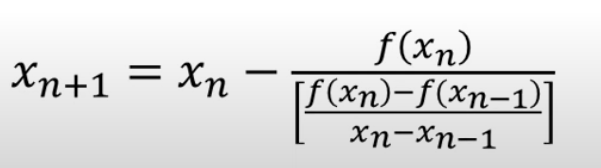
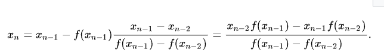
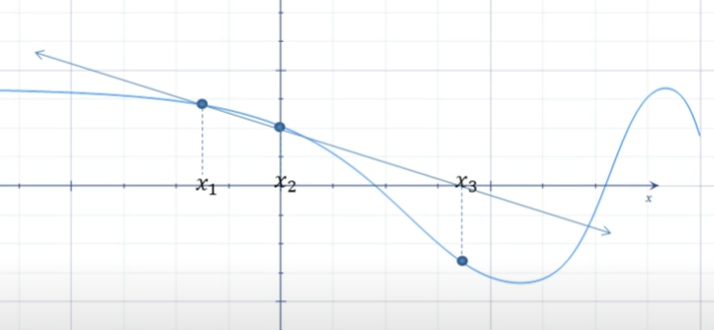
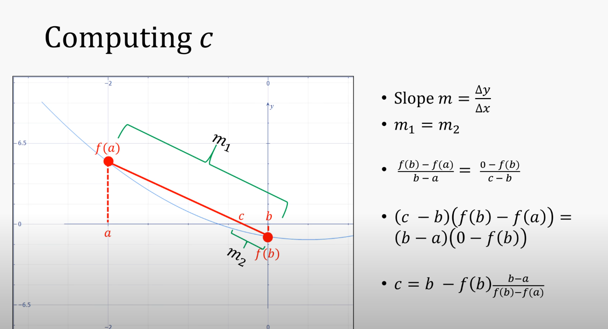
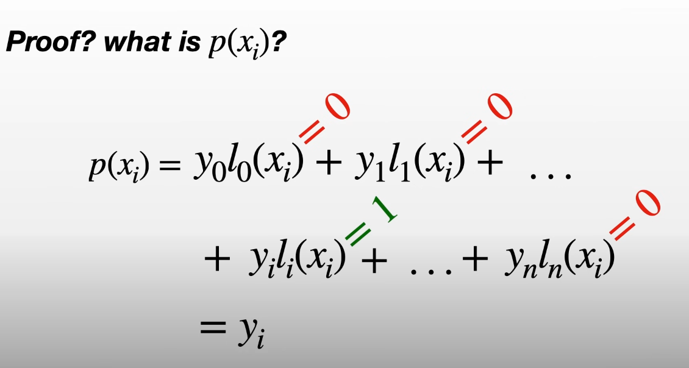

# Érintő módszer (Newton's Method)

https://www.youtube.com/watch?v=j6ikEASjbWE

Célja, hogy egy f(x) függvény gyökét közelítsük (azaz f(x) = 0 egyenlet megoldását közelítse)

Geometria:

- Keresünk egy pontot (x1)
- Érintő behúzása
- Érintő ahol eléri az x tengelyen a 0-t, vesszük új pontnak (x1)
- Ismétlés ameddig megfelelő közelséget el nem érünk

Jó kezdőponttal közelítjük az egyik gyököt

Algebra:

Keressük x1-et.

Van egy derékszögű háromszögem.

Az érintő és x0 között a magasság f(x0)

x1 és x0 közt a távolság a különbségük (fontos, hogy előjeles, szóval `x0 - x1`)

Az érintő meredeksége x0 pontban f függvény deriváltjának értéke x0-ban `f'(x0)`

```
f'(x0) = f(x0) / (x0 - x1)
x1 = x0 - f(x0) / f'(x0)

x(i+1) = x(i) - f(xi) / f'(xi)

```

Problémák:

- vízszintes érintőnél x0 állóhelyzetbe kerül (lokális minimumot vagy maximumot találtunk), és nem fog tudni onnan "kijönni"
- több gyöke van egy függvénynek, nem biztos hogy a keresettet találja meg (négyzetgyöknél ha rossz az indulópontunk, lehet hogy a negatívgyökét találja meg az f függvénynek)
- `f(x) = 3x^2 - 5` és x0 = 1, esetén az első érintő -1-be visz, ami vissza visz 1-be, párhuzamos érintőket találunk, ez miatt végtelen ciklusba kerülünk
- legnagyobb probléma: kell a derivált ismerete, aminek kiszámítása költséges

# Szelő módszer (Secant Method)

Az érintő helyett szelőt használ a gyök kereséséhez

Algebra: (szögletes zárójel csak zárójel)





Geometria:

- Veszünk kettő kezdőpontot (x1, x2)
- Megkeressük hol szelik a függvényt
- Ez lesz az új pontunk (x3)
- ismételjük most x2-vel és x3-mal

Problémák:

- ha rossz kezdőpontokat választunk, a szelők nem fogják metszeni a függvényt, ez miatt 0-val osztanánk

Ez lassabban közelít, mint Newton módszere, azonban könnyebben használható a derivált használatának hiánya miatt

# False Position Method (Húr módszer)

Behúzzuk két pont közé (x1, x2) a húrt, és ahol az érinti az x tengelyt, azt válasszuk a következő pontnak, majd válaszutnk egy új húrt attól függően, hogy azok hogy metszik az x tengelyt (különböző előjel).



- A sebessége lehet olyan lassú, mint a felezőmódszeré, de általában gyorsabb
- Egyszerűbb használni a szelő és az érintő módszert

# Konjugált gradiens

Többváltozós függvény gyökét keresi, vagy egy egyenletrendszer megoldását.

# Lagrange interpoláció

https://www.youtube.com/watch?v=bzp_q7NDdd4

Bizonyos számú pontpárokhoz ad egy közelítő polinomot, amely végigmegy ezeken a pontokon.

Kezdetben keresünk olyan `l(i)(x)` polinomokat, amelyek esetén `l(i)(i) = 1, és l(i)(j) = 0, ahol j != i` (Tehát i. polinom olyan polinom, ahol minden pont egyenlő nullával, kivéve i. pont, ott 1-gyel)

Ezután minden `l(i)` polinomot egy bizonyos `y(i)`-val megszorzunk, és vesszük ezen szorzott polinomok össszegét.

Egyszerű olyan polinomot készíteni, ami bizonyos értékeknél 0, hisz szorzatpárokat készítünk. Legyen 3 pontos Lagrange interpolációnk, akkor l(0) esetén:

És olvashatóság kedvéért:

```
x0 = a
x1 = b
x2 = c
```

```
l*(0)(x) = (x - b)(x - c) // hisz a-hoz keressük a polinomot

Ha megnézzük, akkor l*(0)(0) nem egy lesz, hanem (0 - b)(0 - c), ami nem jó, ezért osztanunk kell ezzel, hogy 1 legyen

l(0)(x) = {(x - b)(x - c)} / {(0 - b)(0 - c)}
```

Általános képlet:


Bizonyítás:



# Numerikus integrálás

https://www.youtube.com/watch?v=AakN4klHoI0

f(x) függvény alatti előjeles terület kiszámolása [a, b] intervallumon.

A függvény alatti területet n darab trapézra bontjuk fel, és azok összterülete adja meg a közelítését a függvény alatti területnek. Minnél több a trapézunk, annál pontosabb a közelítés.

Egy résztrapéz területe:

```
trapez(f, x, y) = (f(x) + f(y)) * (y - x) / 2, ahol f a függvény, x és y pedig egy részintervallum a és b-n belül

végképlet
h = (b - a) / n // átlag szélessége / magassága a trapézoknak, mindegyiknek ugyanaz
integral[a->b] f(x)dx ~= SUM[i = 0 -> (n-1)] trapez(f, a + h*i, a + h*(i + 1))
```
