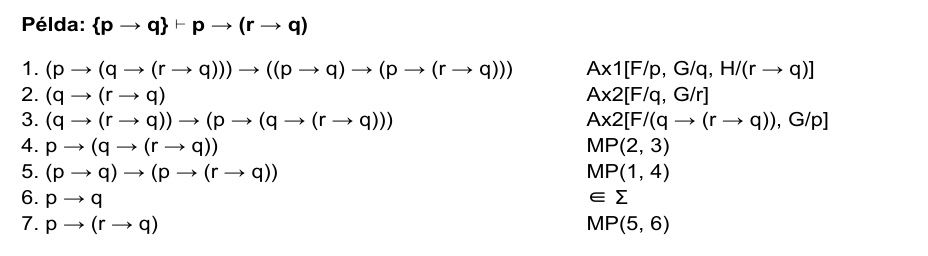
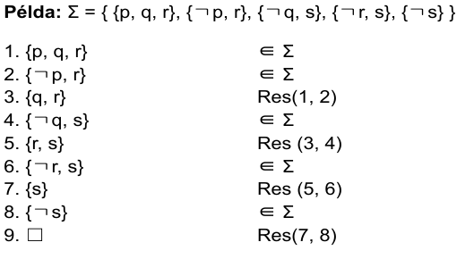

# Normálformák az ítéletkalkulusban

Hogy egyszerűbb legyen az algoritmusokkal dolgozni, és ne kelljen sok szélsőséges esettel foglalkozni, a különböző logikai formulákat normálformákra érdemes hozni. Ilyen például a diszjunkt normálforma (DNF), vagy a konjuktív normálforma (CNF).

A CNF esetén:

- A változókat és azok negáltjait literáloknak nevezzük, pl. `p`, vagy `not(q)`
- Véges sok logikai literál diszjunktát, vagy vagyolását klóznak nevezzük, pl.: `(p or not(q))`
- Véges sok klóz konjukcióját, vagy éselését pedig a konjuktív normálformának, pl.: `(p or not(q)) and (r or not(t))`

Minden formula egy vele ekvivalens CNF-re hozható.

Ha egy formula tartalmaz implikációt vagy ekvivalenciát, azokat érdemes először átalakítani:

Az `F->G` kifejezést át tudjuk alakítani `not(F) or G`-re.

Az `F<->G` kifejezést át tudjuk alakítani `(not(F) or G) and (F or not(G))`

Ha a formulában van tagadás (amely a CNF-et sérti), akkor azt a de Morgan azonossággal érdemes feloldani:

```
not(F or G) = not(F) and not(G)
not(F and G) = not(F) or not(G)
not(not(F)) = F
```

Ilyenkor negációs normálformájú kifejezést kapunk.

Végül a CNF-et sértő or-okat disztributívitást használva oldjuk fel:

```
F or (G and H) = (F or G) and (F or H)
```

```
(F and G) or H = (F or H) and (G or H)
```

Egy CNF-eken értelmezett ismert probléma a SAT, amely inputként egy CNF formulát kap, és outputként megmondja, hogy az kielégíthető-e (azaz a változóknak tudunk-e adni úgy értéket, hogy azok a formulát igazra értékeljék ki).

komplementer(l) az l literál tagadását jelöli, azaz
komplementer(p) = not(p)
és komplementer(not(p)) = p

Ha szigma, klózok halmaza és l egy literál, akkor szigma[l=1] is egy klózhalmaz, amely azt jelöli, hogy az l literálnak milyen értéket adunk.
Mivel azt igazra értékeljük ki, ezért a klózhalmazban minden l-t tartalmazó klózt igazra értékelünk ki, és azon klózoktól már nem fog függni a formulánk helyessége, illetve az l komplementerét / not(l)-t pedig a klózokon belül hagyjuk el.

Ha valamely klózból elfogynak az elemek, azok üres klózok lesznek, és hamisra értékelődnek ki, amely miatt az egész CNF-ünk hamis lesz.

Legyen A értékadás, szigma CNF és l literál.

A |= szigma pontosan akkor igaz, ha

```
A(l) = 1 és A |= szigma|l=1
vagy A(l) = 0 és A |= szigma|l=0
```

Ha szigma = {{p}, {p, q}, {not(p), not(q)}, {p, not(p), r}}, / = not p, akkor Szigma |not(p) = 1 = {üresklóz, {q}}

## Unit propogation

Ha van egységklóz a CNF-ben, akkor az kényszeríti a CNF értékadását. Pl ha szigma = {{p}, {p, q}}, akkor p értékének muszáj egynek lennie.

Ha {{p}, {not(p)}}, esetén mivel az egyik egységklóz miatti értékadás a másikat üresklózba kényszeríti, így ennek a CNF-nek nincs olyan értékadása, amely mellett igaz.

## Pure literal elimination

Ha l olyan literál, melynek komplementere nem fordul elő szigmában, akkor szigma pontosan akkor elégíthető ki, ha szigma mellett l értéke 1.

## DPLL algoritmus

- Ha van egységklóz, akkor a benne lévő literál értékét egyre értékeljük
- Ha van l literál, amelynek komplementere nem szerepel a formulában, akkor l = 1
- Ha egyik eset sem igaz, akkor választunk egy pozitív literált, és kiértékeljük a formulát mint p=1 és mint p=0 mellett.

# Teljes rendszerek

Boole függvények egy H rendszere teljes vagy adekvát, ha minden n változós függvény előáll

- a projekciókból (pi(i) jelöltje az i. változó kiválasztását)
- és H elemeiből

alkalmas kompozícióból.

## Kompozícióból

Ha f egy függvény, akkor f/n azt jelöli, hogy az f függvény n változós.

Ha f/n és g(1)/k...g(n)/k Boole-függvények, akkor f komp. <g1, g2, ...gn> az a k változós Boole függvény, melyre:

(f komp <g1, g2, ..., g(n)>(x1, x2, ..., x(k))) = f(g1(x1, x2, ..., x(k)),...,gn(x1, x2, ..., x(k)))

H akkor teljes, ha vesszük azt az O operátort, melyben a projekciók és H elemei szerepelnek, akkor ez esetén O\*({}) tartalmazza az összes Boole függvényt.

Boole függvényekre is tudunk megszórítást rakni. Pl f|x(n)=b| esetén (n-1) változós f függvényt kapunk, ahol az n. értéket lekötjük b értékére.

Azaz f|xn=b|(x1, x2, ..., xn) = g(x1, x2, ..., x(n-1), b).

or|x2=1| a konstans 1 függvény, mivel (x or 1) vagy or(x, 1) mindig 1-re értékelődik ki.

and|x2=0| a konstans 0 függvény, mivel (x and 0) vagy and(0, x) mindig 0-ra értékelődik ki

and|x2=1| az identity / identikus függvény, amely esetén (x and 1) = x mindig.

Shannon expanzió szerint minden Boole-függvény előáll a projekciók és a {not, and, or} Boole-függvények alkalmas kompozíciójaként. Tehát minden Boole függvény indukálható olyan formulával, amelyben csak a {not, and, or} konnektívák szerepelnek. A {not, and, or} H rendszer teljes.

# Hilbert kalkulus

Hilbert rendszere deduktív következtető rendszer: az input szigma összes következményét (és csak azokat) lehet vele levezetni. Ebben a rendszerben csak a -> (implikáció) konnektívát és a ↓ (azonosan hamis, 0-val fogom jelölni, de az am úgy nem jó).

Három axiómát tartalmaz a rendszer, amelyek mind tautológiák:

```
1: (F-> (G -> H)) -> ((F -> G) -> (F -> H))
2: F -> (G -> F)
3: ((F -> 0) -> 0) -> F
```

Leválasztási következtetés, vagy modus potens egy helyes következtetési szabály, amelynek segítségében le tudunk vezetni formulákat Hilbert rendszerben:

```
{F, F -> G} |= G
```

Azt mondjuk, hogy egy F formula levezethető szigmaból Hibert rendszerben (szigma |- F), ha létezik olyan F1, F2, ... Fn formula sorozat, melynek minden eleme

- szigma beli
- axiómapéldány, vagy
- előáll két korábbiból modus potenssel



A visszavezetés lényege az, hogy axiómapéldányokkal és a levezetés bal oldalán található formulák segítségével állítsuk elő a jobb oldalon látható formulát.

# Rezolúció

Input: klózok Szigma halmaza egy CNF-ből
Output: kielégíthetetlen-e Szigma?
Algoritmus:

- listát vezetünk a klózokról
- egy klózt felvehetünk, ha
  - szigmabeli vagy
  - két, a listán már szereplő klóz rezolvense
- Ha az üres klóz kerül a listára, szigma kielégíthetetlen
- Ha már nem tudunk új klózt felvenni, és nincs köztük üresklóz, szigma kielégíthető



Rezolváláskor csak egy literál mentén rezolválunk.

## Lineáris rezolúció:

mindig az előző lépésben felvett klózhoz veszünk hozzá egyet a szigma klózai közül, és azokat rezolváljuk (a példában is ez történik)

## Horn formula:

Ha minden klóz, Horn klóz benne. Akkor lesz egy klóz Horn klóz, ha a benne lévő literálok közül legfeljebb csak egy pozitív. Ilyen esetben mindig úgy vesszük fel a klózokat, hogy minden képzésben az egyik résztvevő klóz pozitív egységklóz legyen.

## SLD

Selective Linear Definite rezolúció, amely Horn formula esetén nem rezolválunk a listán korábban szereplő klózokkal.
