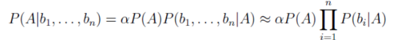

# Teljes együttes eloszlás tömör reprezentációja, Bayes hálók

A logikai igaz / hamis állítások eldöntése problémás lehet ha nem teljes a tudás, nem minden tény vagy szabály ismert, akkor nem fogunk tudni döntést hozni, döntésképtelenek leszünk. Ha heurisztikát vezetünk be, akkor pedig előfordulhat hogy inkonzisztens következtetési rendszert hozunk létre az elmélettel, és téves válaszokat fogunk következtetni.

Például, ha tudjuk hogy lyukas a fogunk, akkor fáj, vagy ha be van gyulladva, akkor is fáj. De azt nem tudjuk megmondani, hogy ha fáj a fogunk, az az miatt van mert be van gyulladva, vagy az miatt mert lyukas.

## Valószínűség:

A tudás tökéletlenségének (azaz ismeretlen tényeknek és szabályoknak)
véletlen hatásként való kezelése. Például, ha az eddigi tapasztalaink esetén 8-szor azért fájt a fogunk mert lyukas volt, és csak 2-ször volt begyulladva, mondhatjuk, hogy 80% a valószínűsége, hogy megint lyukas a fogunk.

A feladat az, hogy ilyen megfigyelésekből és valószínűségi tudásból számoljuk ki az ágens számára a fontos események valószínűségét.

Kettő okból hagyatkozhatunk valószínűség alapú számításra:

- a tudományterület amelyen alkalmaznánk nem elég fejlett, nincsenek kidolgozva a szabályai
- nincs motiváció, megtérülés, akarat amögött (tehát lusták vagyunk arra), hogy a szabályrendszerét a problémának feltérképezzük és összegyűjtsük

## Véletlen változók:

Egy véletlen változónak van neve, és lehetséges értékei (értékkészlet, domain). `A` véletlen változó, `D(A)` a domainje. `A` változó típusai lehetnek a következők:

- logikai: ekkor a domain {igaz, hamis}
- diszkrét: megszámlálható domain, pl. Időjárás {nap, eső, felhő, hó}, előre meghatározott értékeket vehet fel
- folytonos: például A eleme R, azaz bármely valós szám

Kijelentéseket tudjuk összekapcsolni and, or, not stb. logikai operátorokkal.

## Elemi esemény

A véletlen változóknak egy értékadása, azaz A(1), A(2)...A(n) változók mindegyikéhez tartozik egy érték.

Az események összáma ezen véletlen változók domain darabszámjának szorzata (ha a változók függetlenek egymástól). Ha a változók közt van függőség, akkor nem tudjuk általános képlettel meghatározni az összes esemény számát.

## Feltételes valószínűség

P(a|b), ha tudjuk, hogy `b` esemény bekövetkezik, mekkora valószínűséggel következik be `a` P(lyukas fog|fogfájás) = 0.8 azt jelenti, hogyha fáj a fogunk, 0.8 valószínűséggel lyukas fog miatt van.

Bayes tétele

P(a|b) = P(b|a)P(a) / P(b)

P(a és b) = P(a|b)P(b) = P(b|a)P(a)

## Teljes együttes eloszlás

Megadja minden elemi esemény valószínűségét, ebből kiszámolható minden esemény valószínűsége. Azonban minden elemi eseményt felsorolni 2^n méretű táblázattal járna.

## Függetlenség

Ha P(a és b) = P(a)\*P(b) akkor a és b esemény független egymástól.

Feltételes függetlenség

P(a és b | c) = P(a|c)\*P(b|c), azaz a és b független egymástól, ha c esemény bekövetkezik

Az eloszlás reprezentációját tudjuk tömöríteni ezekkel:

P(A, B, C) = P(A, B|C)P(C) = P(A|C)P(B|C)P(C)

A, B, C jelöli változók diszjunkt halmazát. Itt a szorzatszabályt és a feltételes függetlenséget alkalmazzuk.

## Bayes hálók

A Bayes hálók ezt a tömörítési módszert alkalmazza arra, hogy ne 2^n elemi esemény valószínűségét adjunk meg n darab véletlen változó mellé. A háló egy irányított, körmentes gráf

- a csúcsok valószínűségi pontok
- az élek az ok-okozati függőségek
- minden `X(i)` csomóponthoz tartozik egy P(X(i) | Szülők(X(i))) feltételes valószínűségi eloszlás, ami számszerűen megadja a szülők hatását az adott pontra

Láncszabályt alkalmazva egy csomópont valószínűsége (amely X(1), X(2), ..., X(n) változók felsorolása):

P(X(1), X(2), ..., X(n)) = P(X(1)|X(2), ..., X(n))P(X(2), X(3), ..., X(n))

## Naív Bayes algoritmus

Statisztikai következtetési módszer. Egy kezdő adatbázisban található példák alapján ismeretlen példákat osztályoz. Pl. a feladat lehet spam és nem spam üzenetek osztályozása. A kezdő adatbázisban meghatározott spam és nem spam emailek találhatóak. Legyen A véletlen változó jelentése, hogy spam-e az email vagy sem, illetve az osztályozandó emailünk szavai alapján B(i) az a véletlen változó, amely szerint az osztályozandó email i. szava előfordul.

Tehát, P(A|B(2)) = 0.5, azaz az emailünk második szava 0.5 valószínűséggel fordul elő a spam üzenetek közt.

A feladat tehát, hogy A mely értékére lesz P(A|B(1), B(2), ... B(n)) feltételes valószínűség maximális.

A képletben P(A) lehetséges értékei közti sorrendet keressük, ez miatt alpha értéke lényegtelen. Amely A érték mellett P(A) a legnagyobb értéket veszi fel, a Naív Bayes algoritmus azt az értéket fogja választani.

# Gépi tanulás

## Felügyelt (induktív tanulás)

Ennek során van egy tanító adatbázis, ami a tanulópéldákhoz a feladat megoldására vonatkozó közvetlen információkat tartalmazza. Lényeg, hogy olyan összefüggést kell a tanult adatokból összerakni, amely képes a tanult adatokat jól visszakapni és az ismeretlen adatokat is ki tudja számolni.

A feladat tehát egy olyan f függvény megkeresése, amely x pontra megtudja mondani az f(x)-et, és (xn, f(xn)) párokat tud képezni:

- xn érték valamilyen szituációt vagy objektumot ír le
- f(x) egy ún. címke, amely megmondja, hogy ez az objektum milyen értékekkel rendelkezik a megfigyelés alapján
- ha x egy kép, f(x) jelölheti, hogy macska van-e a képen

Ha van egy f függvényünk, ami ismeretlen, viszont n pontban ismerjük az értékeket (amely a tanuló adatbázis), akkor erre egy h függvénnyel fogunk közelíteni.

### h függvény konzisztens az adatokkal

Ha helyesen címkézi a tanítóadatokat, akkor h(xi) = f(xi)

A tanítópéldák sokszor zajosak, hibásak, és előfordulhat, hogy ezeket is megtanulja, amely nem kívánatos.

A cél, hogy olyan f-et közelítse, amely a példákon kívül is jól általánosít, vagy válaszol.

### Magolás

Ha h(x) = f(x) csak a tanult példákon következik be, de az ismeretleneken példákon nem,ilyenkor túlilleszkedés történik, ennek elkerülése végett tömmör reprezentációkra kell törekedni inkább, de vannak olyan listák amelyek nem tömöríthetőek.

### Összefoglalva

- tömör reprezentáció kell
- elég kifejezőnek kell lennie a reprezentációnak, hogy a tanítópéldákat jól közelítsük
- számítási szempontból egyszerű reprezentáció és hipotézistér is kell a hatékonyság miatt

## Felügyelet nélküli tanulás

x1, x2, ..., xn példák, viszont nem függvényt keresünk, hanem mintázatot, eloszlást

### Megerősítéses tanulás

Itt az a lényeg, hogy megtanuljon az ágens egy optimális stratégiát, úgy hogy maximalizálja a jutalmat

# Döntési fák

Az induktív tanulás egy konkrét példája:

Van egy x példánk és egy f(x) címkénk egy adatbázisban

- f(x) diszkrét címke (diszkrét változók egy vektora), minden x-re meg kell mondani hogy igaz vagy hamis
- Ha Y véges halmaz, akkor osztályozási feladatról van szó
- Ha Y folytonos, akkor regresszió

Mivel Y véges halmaz, ahol x elemeit kell osztályba sorolni, ezen osztályok pedig Y értékei. X a tanítópéldák halmaza, pl. emailek halmaza, Y pedig az osztályok halmaza (pl. Y = {spam, nem spam}).

Elméletben a döntési fák ember számára könnyen értelmezhető, azonban a gyakorlat ezt azzal cáfolja, hogy hatalmas döntési fák szoktak keletkezni, amely a mérete miatt nehezen értelmezhető.

## Hipotézistér döntési fáknál

Döntési fából logikai formulát lehet készíteni, amiből újra lehet döntési fát.

## Döntési fa építése

- Melyik változó szeparálja legjobban a pozitív és negatív példákat?
- Melyik hordozza a legtöbb információt?

A gyökérbe azt válasszuk, amelyik a legjobban szeparálja a példákat:

Erre rekurzív algoritmus, amely bejárja a fát.

Esetek, amikor megáll:

1. Ha csak pozitív, vagy csak negatív példa van, akkor a levélhez értünk, és azt megcímkézzük megfelelő módon
2. Ha üres halmaz, akkor többértékű szülő
3. Ha pozitív és negatív példa is van, de nincs több változó. Ez azt jelenti, hogy van ellentmondás az adatbázisban.

Ehhez a feladathoz olyan függvény kell, amely jellemzi, hogy mennyire van összekeverve a pozitív és negatív címke.

### Entrópia

Egy valószínűségi eloszláshoz tartozik és azt jellemzi, hogy mennyire egyenletes az eloszlás. Max: rendezetlenség max, min: rendezetlenség min

### Magolási probléma döntési fáknál

Túlillesztés során az adatbázis statisztikai hibáit / varianciáit beleépíthetjük a modellbe és ez garantáltan az általánosítás rovására megy.
